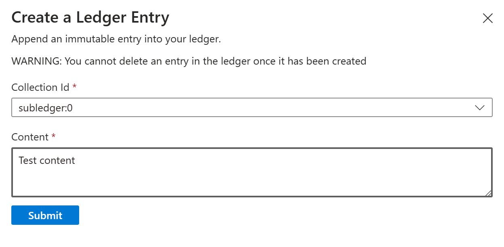
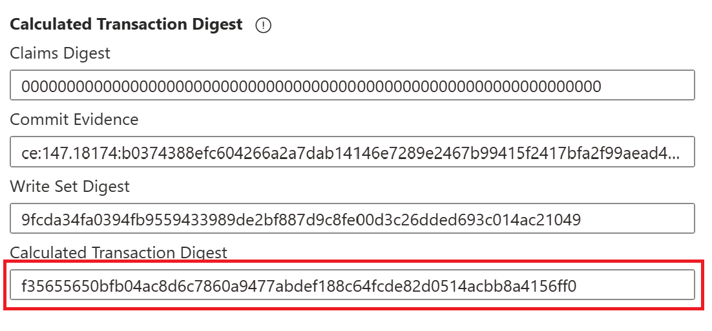
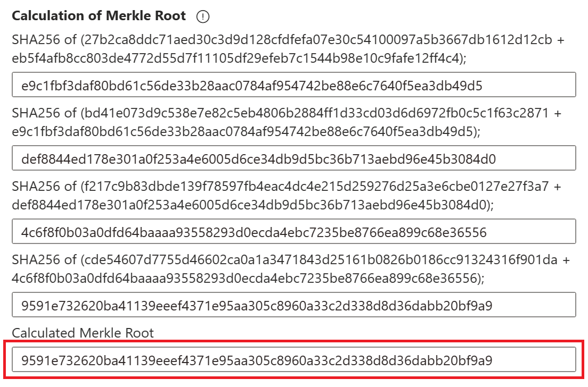

# Use the Azure portal ledger explorer to verify transactions

This article shows you how to use the Azure portal ledger explorer to list and view transactions, create new ledger entries, and verify the integrity of your data using cryptographic proofs. For background on what the Ledger Explorer tools are, how they differ, and when to use each one, see [Ledger Explorer concepts](./ledger-explorer-concepts.md).

> [!NOTE]
> This article covers the Azure portal ledger explorer. To inspect exported or local ledger data, see [Inspect ledger data with Ledger Explorer (Offline)](./ledger-explorer-offline.md).

## Prerequisites

- An Azure subscription - [create one for free](https://azure.microsoft.com/pricing/purchase-options/azure-account?cid=msft_learn).
- An Azure Confidential Ledger instance. If you don't have one, see [Quickstart: Create a confidential ledger using the Azure portal](./quickstart-portal.md).
- A Microsoft Entra ID user with a Reader, Contributor, or Administrator role assigned for the confidential ledger resource. For help managing users, see [Manage Microsoft Entra token-based users in Azure confidential ledger](./manage-azure-ad-token-based-users.md).

## Open the ledger explorer

1. Sign in to the [Azure portal](https://portal.azure.com) as a Microsoft Entra ID user who has a Reader, Contributor, or Administrator role for the confidential ledger resource.
1. Navigate to your confidential ledger resource.
1. On the Overview page, select the **Ledger explorer (preview)** tab.

:::image type="content" source="./media/ledger-explorer-entry.png" alt-text="Screenshot of Ledger explorer item in the menu bar." lightbox="./media/ledger-explorer-entry.png":::

The ledger explorer displays an ordered list of all transactions on your ledger with their IDs and contents, filtered by collections. The ledger is an append-only, sequential datastore with data starting from Transaction ID `2.1`.

## Search for a transaction

[CCF Transaction IDs](https://microsoft.github.io/CCF/main/use_apps/verify_tx.html#verifying-transactions) require both a view and a sequence number, separated by a period (for example, `2.15`). Valid Transaction IDs start at `2.1`. Each transaction receives a unique sequence number assigned by the system.

1. If you previously recorded a specific Transaction ID, enter it in the search box to locate that transaction.
1. Use the filters and the search box to start your transaction search from any Transaction ID.

:::image type="content" source="./media/ledger-explorer-search.png" alt-text="Screenshot of how to search for a transaction in Ledger explorer." lightbox="./media/ledger-explorer-search.png":::

## Create a ledger entry

If you have an Administrator or Contributor role, you can create new ledger entries directly from the explorer.

1. Select the **Create** button in the command bar.
1. Enter a **Collection ID** for the entry. A default Collection ID `subledger:0` is assigned if you don't specify one. You can change the Collection ID using the dropdown, or specify a new collection by typing it in the **Collection Id** field.
1. Enter the content for the entry and submit it.

> [!WARNING]
> Ledger entries are immutable. Once you commit a transaction, you can't delete it.

## Verify transaction integrity

Azure Confidential Ledger provides cryptographic evidence that your data hasn't been tampered with, through transaction receipts. The ledger explorer performs the verification steps described in [Verify Azure Confidential Ledger write transaction receipts](./verify-write-transaction-receipts.md). For background on how verification works across both explorer tools, see [Ledger Explorer concepts](./ledger-explorer-concepts.md).

To verify a transaction:

1. Select a transaction in the ledger explorer.
1. Select the **Proof** tab.

### Leaf node computation

The transaction digest is computed from the **Claims Digest**, **Commit Evidence**, and **Write Set Digest**. This transaction digest is inserted as a leaf node into the Merkle tree.

This step corresponds to [Leaf node computation](./verify-write-transaction-receipts.md#leaf-node-computation) in [Verify Azure Confidential Ledger write transaction receipts](./verify-write-transaction-receipts.md).

### Root node computation

The transaction receipt provides a cryptographic proof with the Merkle tree branches that leads to the root of the Merkle tree.

This step corresponds to [Root node computation](./verify-write-transaction-receipts.md#root-node-computation) in [Verify Azure Confidential Ledger write transaction receipts](./verify-write-transaction-receipts.md).

### Signature verification

When the transaction is committed, the primary node signs the Merkle root. To verify that the transaction was committed by your ledger and hasn't been tampered with, the ledger explorer uses the public key of the signing node and the digital signature to verify that the calculated Merkle root matches the signed value.

The explorer then checks that the signing node is endorsed by the ledger. If the transaction is committed and hasn't been tampered with, the explorer indicates that the **Globally Committed Status** is **verified**.

This step corresponds to [Verify signature over root node](./verify-write-transaction-receipts.md#verify-signature-over-root-node) and [Verify signing node certificate endorsement](./verify-write-transaction-receipts.md#verify-signing-node-certificate-endorsement) in [Verify Azure Confidential Ledger write transaction receipts](./verify-write-transaction-receipts.md).

## Related content

- [Ledger Explorer concepts](./ledger-explorer-concepts.md)
- [Inspect ledger data with Ledger Explorer (Offline)](./ledger-explorer-offline.md)
- [Azure Confidential Ledger write transaction receipts](./write-transaction-receipts.md)
- [Verify Azure Confidential Ledger write transaction receipts](./verify-write-transaction-receipts.md)
- [Quickstart: Microsoft Azure confidential ledger client library for Python](./quickstart-python.md)

