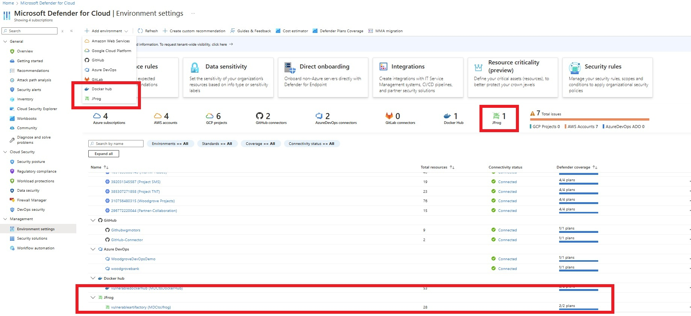

# Vulnerability assessments for Jfrog Artifactory (Cloud) external registry with Microsoft Defender Vulnerability Management

A key aspect of Defender for Containers' security solution is to provide container image vulnerability assessment throughout its lifecycle, from code development to cloud deployment.

To achieve this goal, comprehensive coverage is needed for all stages of the container image life cycle, including container images from external registries. With this feature we are extending our external registries coverage to Jfrog Artifactory (Cloud), widely used by enterprises and SMBs.   

Customers using Jfrog Artifactory, “Cloud” distribution flavor, can use Defender for Containers for inventory discovery, security posture evaluation, and vulnerability assessment - enjoying the same security capabilities available for cloud-native registries like ACR, ECR, and GCR.

## Functionality

Inventory – Identify and list all available container images within the Jfrog Artifactory tenant.

Vulnerability Assessment– Regularly scan the Jfrog Artifactory tenant for supported container images, identify vulnerabilities, and provide recommendations for issues to be addressed.

## Prerequisites

•	To use Microsoft Defender for Containers with your organizational Jfrog Artifactory account you must have administrative access to your Jfrog Artifactory tenant.
•	Run the installation from **Windows**, **Linux** or **macOs** machine.
•	The following tools to be installed on the machine from which you are running account configuration.
- Installation of Jfrog CLI tool (for details and installation guidelines please refer to Jfrog official documentation: [JFrog CLI | JFrog Applications](https://docs.jfrog-applications.jfrog.io/jfrog-applications/jfrog-cli) )
- Installation of [https://jqlang.github.io/jq/](https://jqlang.github.io/jq/) for JSON parsing and manipulation`

## Onboarding of Jfrog Artifactory environment  

Individuals who have "Security administrator" or “Global administration” privileges in Microsoft Defender for Cloud can add a new Jfrog Artifactory environment

Each environment corresponds to a distinct Docker Hub organization. The onboarding interface for adding a new external registry allows the user to designate the type of container registry as a new environment classified as "Docker Hub".

:::image type="content" source="media/agentless-vulnerability-assessment-docker-hub/defender-for-cloud-add-environment-docker-hub.png" lightbox="media/agentless-vulnerability-assessment-docker-hub/defender-for-cloud-add-environment-docker-hub.png" alt-text="Screenshot of the Add Environment button. ":::

**The environment wizard assists with the onboarding process:**

1. Connector Details

   :::image type="content" source="media/agentless-vulnerability-assessment-docker-hub/defender-for-cloud-docker-hub-connector-details.png" lightbox="media/agentless-vulnerability-assessment-docker-hub/defender-for-cloud-docker-hub-connector-details.png" alt-text="Screenshot of the Docker Hub connector details panel.":::

    Connector name: Specify a unique connector name.

    Location: Specify the geographic location where Defender for Cloud stores the data associated with this connector.

    Subscription: The hosting subscription that defines the RBAC scope, and billing entity for the Docker Hub environment.

    Resource group: for RBAC purposes

    > [!NOTE]
    > Only one subscription can be linked to a Docker Hub environment instance. However, container images from this instance can be deployed to multiple environments protected by Defender for Cloud, outside the boundaries of the associated subscription.

    Scanning intervals:  Set the container registry re-scan interval with hourly precision.

2. Select Plans

    Multiple plans exist for these kinds of environments:

    :::image type="content" source="media/agentless-vulnerability-assessment-docker-hub/defender-for-cloud-docker-hub-connector-select-plan.png" lightbox="media/agentless-vulnerability-assessment-docker-hub/defender-for-cloud-docker-hub-connector-select-plan.png" alt-text="Screenshot of the Docker Hub connector select plan panel.":::

   - Foundational CSPM: Basic plan available for all customers, provides inventory capabilities only.

   - Containers: Offers inventory and vulnerability assessment features.  

   - Defender CSPM: Offers inventory and vulnerability assessment features, plus extra capabilities like attack path analysis and code-to-cloud mapping.

    For information regarding the plan pricing review [Microsoft Defender for Cloud pricing](https://azure.microsoft.com/pricing/details/defender-for-cloud/).  

    Ensure your Docker Hub environment plans are in sync with your cloud environment plans and share the same subscription to maximize coverage.

3. Configure Access

    To maintain a continuous and secure link between Defender for Cloud and your Docker Hub organization, ensure you have a dedicated user with an organization email address. Each Docker Hub connector corresponds to one Docker Hub organization. Therefore onboard a separate Docker Hub environment connector in Defender for Cloud for each Docker Hub organization you manage to achieve optimal security coverage for your container software supply chain.

    Follow the steps in [How to set up Docker Hub as an external registry](defender-for-containers-enable-external-registry-for-docker-hub.md) to prepare your Docker Hub organization account for integration.

    Provide these parameters from your Docker Hub user to establish a connection.

   - Organization: Docker Hub organization name

   - User: Assigned Docker Hub username  

   - Access token: Docker Hub user read-only access token

    :::image type="content" source="media/agentless-vulnerability-assessment-docker-hub/defender-for-cloud-docker-hub-connector-configure-access.png" lightbox="media/agentless-vulnerability-assessment-docker-hub/defender-for-cloud-docker-hub-connector-configure-access.png" alt-text="Screenshot of the Docker Hub connector configure access panel.":::

4. Review and generate

    Review all the configured connector details before onboarding finalization.

    :::image type="content" source="media/agentless-vulnerability-assessment-docker-hub/defender-for-cloud-docker-hub-connector-review-generate.png" lightbox="media/agentless-vulnerability-assessment-docker-hub/defender-for-cloud-docker-hub-connector-review-generate.png" alt-text="Screenshot of the Docker Hub connector review and generate panel.":::

5. Validate connectivity  

    Verify the connection is successful and displays "Connected" on the environment’s settings screen.

    :::image type="content" source="media/agentless-vulnerability-assessment-docker-hub/defender-for-cloud-docker-hub-connector-verify.png" lightbox="media/agentless-vulnerability-assessment-docker-hub/defender-for-cloud-docker-hub-connector-verify.png" alt-text="Screenshot of the Docker Hub connector environment connected status in the Defender for Cloud environments panel.":::

6. Validate feature capabilities

    Docker Hub initiates container registry scanning within one hour after onboarding:  

   - Inventory – Make sure your Docker Hub connector and its security status appear in the Inventory view.

   - Vulnerability Assessment – Ensure you receive the recommendation "(Preview) Container images in Docker Hub registry should have vulnerability findings resolved" for addressing security issues in your Docker Hub container images.

