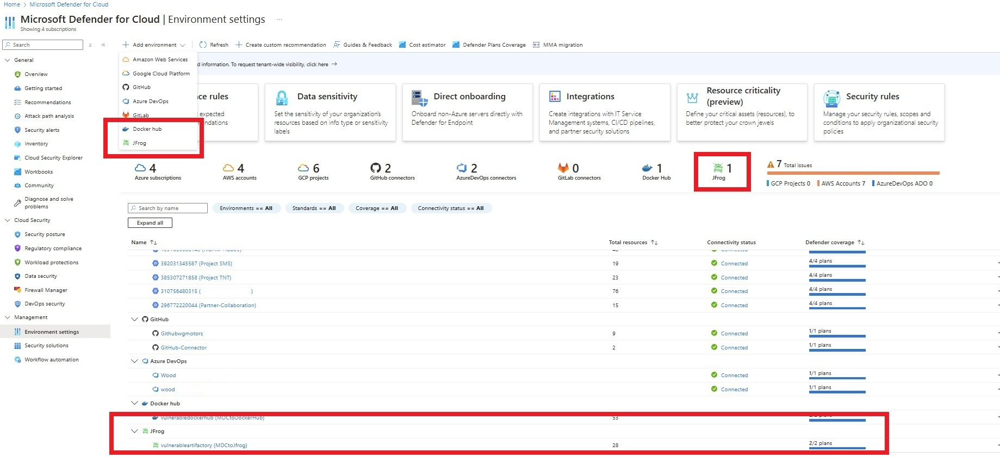

# Vulnerability assessments for JFrog Artifactory (Cloud) external registry with Microsoft Defender Vulnerability Management

A key aspect of Defender for Containers' security solution is to provide container image vulnerability assessment throughout its lifecycle, from code development to cloud deployment.

To achieve this goal, comprehensive coverage is needed for all stages of the container image life cycle.
JFrog Artifactory (Cloud) container registry is widely used by by both enterprises and SMB organizations.
Covering container images from external registries such as JFrog Artifactory, is an essential part of container software supply chain.

Microsoft Defender for Containers provides security for the JFrog Artifactory through inventory discovery, security posture evaluation, and vulnerability assessment - the same security capabilities available also for cloud-native registries like ACR, ECR, and GCR.

## Functionality

**Inventory** – Identifies and lists all available container images within the JFrog Artifactory tenant.

**Vulnerability Assessment** – Regularly scans the JFrog Artifactory tenant for supported container images, identifies vulnerabilities, and provides recommendations for issues to be addressed.

## Prerequisites

To use Microsoft Defender for Containers with your organizational JFrog Artifactory account you must have administrative access to your Jfrog Artifactory tenant.
Installation scripts support following operation systems:  **Windows**, **Linux**, or **macOs** .
Make sure the following tools are installed on the machine running the installation script:

   - Installation of JFrog CLI tool (for details and installation guidelines refer to Jfrog official documentation: [JFrog CLI](https://docs.jfrog-applications.jfrog.io/jfrog-applications/jfrog-cli) )
   
   - Installation of [jq JSON parser](https://jqlang.github.io/jq/)

## Onboarding of JFrog Artifactory environment  

Individuals who have "Security administrator" or "Global administration" privileges in Microsoft Defender for Cloud can add a new JFrog Artifactory environment

 > [!NOTE]
>Each connector corresponds to only one JFrog Artifactory tenant.
>You must create a connector for each tenant that is to have security coverage.

The onboarding interface for adding a new external registry allows the user to designate the type of container registry as a new environment classified as "JFrog Artifactory".

**The JFrog environment wizard assists with the onboarding process:**

1. *Connector Details*

   **Connector name:** Specify a unique connector name.
   
   **Location:** Specify the geographic location where Defender for Cloud stores the data associated with this connector.
   
   **Subscription:** The hosting subscription that defines the RBAC scope, and billing entity for the JFrog Artifactory environment.
   
   **Resource group:** for RBAC purposes.
        
   **Scanning intervals:**  Set the container registry rescan interval with hourly precision.
   
   **Server ID:** A prefix of customers JFrog Artifactory account URL. Example:   **MYSERVERID** is the server ID of **https:/MYSERVERID.jfrog.io/** 

   > [!NOTE]
   > A single subscription can be linked to one JFrog Artifactory environment instance, although container images from this instance may be deployed to multiple environments that are overseen by Defender for Cloud, outside the boundaries of the associated subscription.

2. Select Plans
   
 Multiple plans exist for these kinds of environment:
     

**Foundational CSPM:** Basic plan available for all customers, provides inventory capabilities only.

**Containers:** Offers inventory and vulnerability assessment features.  

**Defender CSPM:** Offers inventory and vulnerability assessment features, plus extra capabilities like attack path analysis and code-to-cloud mapping.

> [!NOTE] 
>For information regarding the plan pricing review [Microsoft Defender for Cloud pricing](https://azure.microsoft.com/pricing/details/defender-for-cloud/).  
>Ensure your JFrog Artifactory environment plans are in sync with your cloud environment plans and share the same subscription to maximize coverage.

3. Configure Access

To maintain a continuous and secure link between Defender for Cloud and your JFrog Artifactory tenant, you need to execute a connector scripting via Jfrog CLI.

> [!NOTE] 
>Each JFrog Artifactory connector corresponds to one JFrog Artifactory tenant.
> Therefore, onboard a separate JFrog Artifactory environment Connector in Defender for Cloud for each JFrog Artifactory tenant you're administrating to achieve optimal security coverage for your container software supply chain.

Download the relevant installation script, based on the operating system of the environment from which you intend to run the connector script (**Windows**, or **Linux/macOS** )

Execute the connector script via [Jfrog CLI](https://docs.jfrog-applications.jfrog.io/jfrog-applications/jfrog-cli)

4. Review and generate

Review all the configured connector details before generating the JFrog connector.
   

5. Validate connectivity  

Verify the connection is successful and displayed on the environment settings screen.

6. Validate the feature is working properly
   
> [!NOTE] 
> JFrog Artifactor initiates container registry scanning within one hour upon onboarding.

- **Inventory** – Make sure your see JFrog Artifactory container images in __Microsoft Defender for Cloud__ | Inventory view

-  __Vulnerability Assessment –__ Ensure you receive the recommendation "[Preview] Container images in JFrog Artifactory registry should have vulnerability findings resolved" for addressing security issues in your JFrog Artifactory container images.

__Related content__

- [Overview of Container security in Microsoft Defender for Containers](/azure/defender-for-cloud/defender-for-containers-introduction)

- [How-to view and remediate vulnerability assessment findings for registry images](/azure/defender-for-cloud/view-and-remediate-vulnerability-registry-images)

