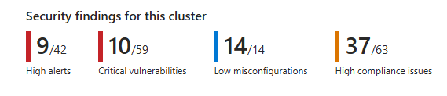
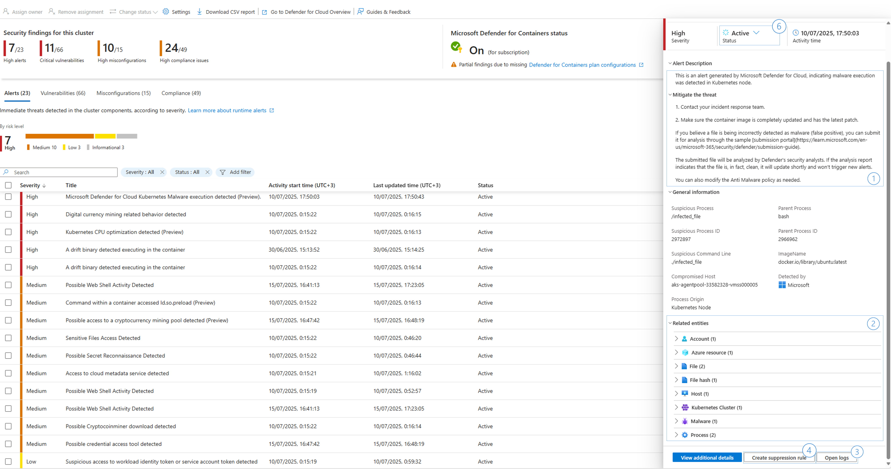
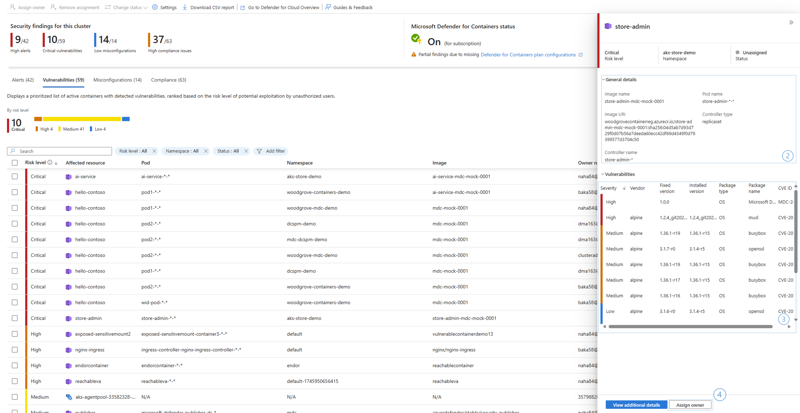
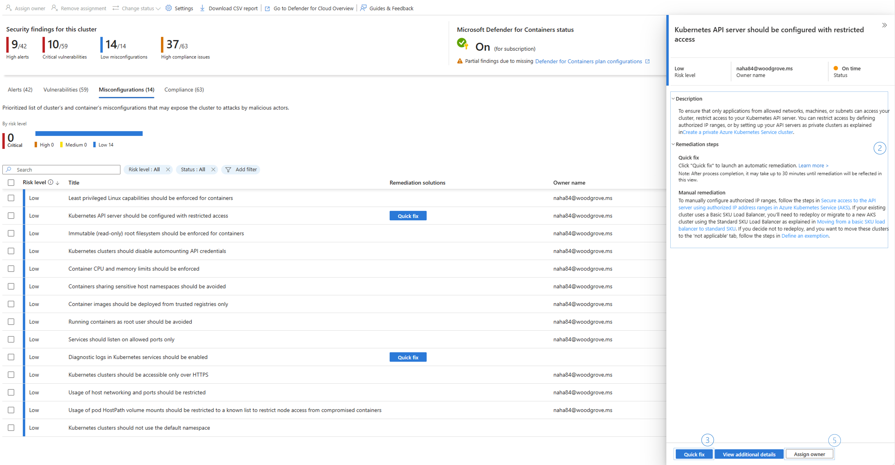
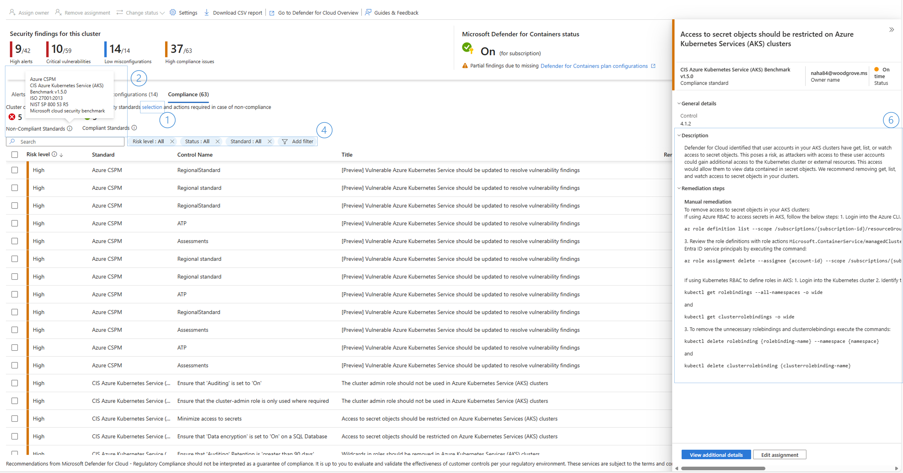

# Azure Kubernetes Service (AKS) Security Dashboard

The AKS security dashboard provides comprehensive visibility and automated remediation capabilities for security issues, empowering platform engineering teams to easily, and more effectively, secure their Kubernetes environment.

Consolidating security and operational data in one place directly within the AKS portal allows engineers to benefit from a unified view of their Kubernetes environment. The view enables more efficient detection and remediation of security issues, with minimal disruption to their workflows to reduce the risk of overlooking security issues and improving remediation cycles.

The AKS Security Dashboard allows the user to:

- Review, investigate, and get guided remediation for: runtime threat detection alerts, vulnerability assessment, security misconfigurations and deviation from compliance standards.

- Enable Defender for Containers plan and configure settings for the specific AKS cluster.

- Assign an owner and track progress to a security issue (Available with Defender Cloud Security Posture Management (DCSPM) enabled for the subscription.)

## Prerequisites

The AKS Security Dashboard shows security issues for a cluster if at least one of the following plans is enabled:

- [Defender for Containers on the subscription](tutorial-enable-containers-azure.md) or [the individual cluster](#setting-the-defender-for-containers-plan)
- [DCSPM](tutorial-enable-cspm-plan.md) on the subscription

## Using the AKS Security Dashboard

The AKS Security Dashboard is accessed from an AKS cluster resource pane by selecting **Microsoft Defender for Cloud** in the menu list. 

#### Understanding the Dashboard Sections

__Security Findings__

The top findings bar shows immediately the security status of the cluster, for each findings type, it will show the number of the highest severity/risk issues. Use the top findings to decide if you should look into the different tabs to investigate further.

### Security Alerts Tab

Security alerts are notifications from Defender for Cloud about suspicious activity or potential threats in your environment in real time. The alerts are prioritized to risk,

Clicking on each alert, opens a panel with additional information about the detection that triggered the alert and additional possible actions to mitigate the issue.

**Alerts Severity**  

**High** There is a high probability that your resource is compromised. You should look into it right away. Defender for Cloud has high confidence in both the malicious intent and in the findings used to issue the alert. 

**Medium** Probably a suspicious activity and might indicate that a resource is compromised. The confidence in the analytic or finding is medium, and the confidence of the malicious intent is medium to high. These would usually be machine learning or anomaly-based detections. 

**Low** This might be a benign positive or a blocked attack. 

**Informational** An incident is typically made up of several alerts, some of which might appear on their own to be only informational, but in the context of the other alerts might be worthy of a closer look.

#### When investigating an alert:

1. Review the alert description and recommended steps for response in the alert right panel.

1. Use the additional details and the related entities to identify the compromised workload.

1. Use the open logs button to investigate the logs in the relevant timeframe.

1. Create a suppression rule - provides the option to suppress future alerts with similar characteristics if the alert isn’t relevant for your organization [Learn more](/azure/defender-for-cloud/alerts-suppression-rules) about suppression rules.

1. Configure security rules for the cluster, to control some of the alert types. [Learn more](/azure/defender-for-cloud/binary-drift-detection) on how to configure drift policies

1. Once an alert is mitigated, change the alert status, for future reference or filtering (requires security admin role).

**Note:** Alerts from defender for cloud are also streamed directly to [Microsoft XDR](https://www.microsoft.com/en-us/security/business/solutions/extended-detection-response-xdr).

**[Learn more](/azure/defender-for-cloud/alerts-overview)** about security alerts in Defender for Cloud.

### Vulnerability Assessment Tab 

The AKS security dashboard surfaces software vulnerabilities scan results for running containers and the cluster’s Node pools, generating a prioritized list of vulnerable components. This list is ranked based on a dynamic engine that assesses the risks in your environment (available with DCSPM plan enabled), considering the potential for exploitation.

The scanning of container images includes the following:

- Scanning OS packages: Identifies vulnerabilities in packages installed by the OS package manager in both Linux and Windows OS. Refer to the  [full list of the supported OS and their versions](/azure/defender-for-cloud/support-matrix-defender-for-containers?WT.mc_id=Portal-fx).

- Language-specific packages (Linux only): Supports scanning for language-specific packages and files, along with their dependencies, that are installed or copied without using the OS package manager. See the [complete list of supported languages](/azure/defender-for-cloud/support-matrix-defender-for-containers?WT.mc_id=Portal-fx).

#### When reviewing vulnerability assessment findings:

Click the vulnerable component in the vulnerabilities tab, to open the details panel.

Use the general details to identify the relevant component and ownership for fix.

Review the list of CVEs, use the package name and the fixed version information to identify to which package version, the package should be upgraded to, to remediate the issue.

Use the assign owner (available with DCSPM plan), to assign an owner for the fix, and notify them by e-mail or with a ticket in service now.

[Learn more](/azure/defender-for-cloud/agentless-vulnerability-assessment-azure?tabs=azure-new%2Cazure-old) about vulnerability assessment in defender for cloud.

### Misconfigurations Tab

Microsoft Defender for Cloud continuously monitors Azure and AKS APIs, along with Kubernetes workloads. It identifies configurations within the cluster or its running containers that could affect the cluster's security posture and expose the cluster to risk. Defender also offers guidelines and automatic fixes to address these issues.  

#### When reviewing misconfiguration assessment findings:

Click the misconfigured component in the misconfiguration tab, to open the details panel.

Review the description and remediation steps.

For cluster level misconfigurations, use the “Quick Fix” button to start remediation flow.

For containers misconfigurations, it is recommended to deploy policy to prevent future faulty deployments. Use the link to a relevant built-in “Azure Policy” policy.

 Use the assign owner (available with DCSPM plan), to assign an owner for the fix, and notify them by e-mail or with a ticket in service now.

[Learn more](/azure/defender-for-cloud/kubernetes-workload-protections) about how to remediate security misconfigurations with Defender for Cloud.

### Compliance Tab

Defender for Cloud continuously assesses your environment against selected regulatory standards and benchmarks. It provides a clear view of your compliance status, highlights unmet requirements, and offers recommendations to help you improve your cloud security posture.

#### How to use the compliance tab:

1. Configure the required compliance standard you need to adhere to. Configuration is done in the subscription level, follow the link for configuration from the compliance tab or the dashboard settings.

1. Once correct standards are selected, use the compliance tab summery to understand which standard you comply with and which requires additional steps to comply with.

1. The compliance tab grid shows only recommendations for controls the cluster or its components aren’t complying to.

1. Use the filters to filter the recommendations grid according to your needs.

1. Click each recommendation to open the details panel.

1. Follow the remediation steps in the side panel to comply with the relevant control.

[Learn more ](/azure/defender-for-cloud/concept-regulatory-compliance-standards)about regulatory compliance in Defender for Cloud.

[Learn more about how to configure regulatory compliance standards](/azure/defender-for-cloud/update-regulatory-compliance-packages)

 

### Bulk Actions

It is possible to select multiple recommendations or alerts using the checkbox beside each recommendation and then “__Assign owner”__ for recommendations __or “Change Status”__ for alerts in the dashboard tool bar.

### Export Security Findings 

Selecting Download CSV report downloads the cluster security findings as a CSV file. Security findings can also be retrieved using the [Defender for Cloud REST API](/rest/api/defenderforcloud-composite/assessments).

### Setting

#### Plan Enablement 

Defender for Cloud, containers protection (Defender for Containers) can be enabled either for a single AKS cluster or on the subscription level, which will apply it to all clusters within the subscription. Enabling the plan can be done through the settings panel, available from the dashboard toolbar

Note: In the case where Defender for Containers is enabled on the subscription level, plan settings can only be changed on the subscription level.

**Note:** By enabling other Defender for Cloud plans on top, defender can scan through your entire cloud assets and identify cross resources attack paths, identify risk more accurately and provide alerts and full visibility into cross resources security incidents. [Learn more.](/azure/defender-for-cloud/defender-for-cloud-introduction)

#### Plan configurations

__Defender Sensor –__ Deploying Defender for Containers agent on the cluster, required for runtime threat protection and gated deployment capabilities.

__Kubernetes API access__ – Required for vulnerability assessment, misconfigurations, compliance assessment and runtime threat protection.

__Registry access__ – Required for vulnerability assessment and gated deployment capabilities.

__Azure policy__ - Deployment of an agent on the cluster to generate recommendations for hardening the cluster data plane.

**Note:** If settings are configured at the subscription level, they will override any settings configured at the cluster level.

The Defender for Containers plan for the cluster or the subscription can also be set using [REST API commands](/rest/api/defenderforcloud-composite/pricings/update).
