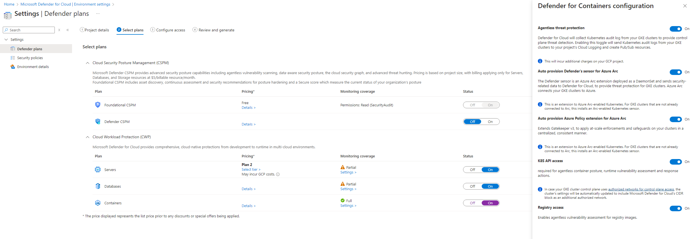

# Configure Defender for Containers on GCP (GKE)

Microsoft Defender for Containers provides advanced threat protection for your Google Kubernetes Engine (GKE) clusters. This article explains how to configure and manage the various components.

## Prerequisites

- A GCP project connected to Microsoft Defender for Cloud
- GKE clusters in your GCP project
- Appropriate permissions to modify GCP resources

## Enable the Containers plan

> [!IMPORTANT]
> If you haven't already enabled Defender for Containers on GCP, see [Enable Defender for Containers on GCP via portal](defender-for-containers-gcp-enable-portal.md).

To help protect your GKE clusters, use the following steps to enable the Defender for Containers plan on the relevant GCP project.

> [!NOTE]
> Verify that you don't have any Azure policies that prevent the Azure Arc installation.

1. Sign in to the [Azure portal](https://portal.azure.com).

1. Go to **Microsoft Defender for Cloud** > **Environment settings**.

1. Select the relevant GCP connector.

   

1. Select **Next: Select plans**.

1. Ensure that the toggle for the **Containers** plan is **On**.

   

1. To change optional configurations for the plan, select **Settings**.

   

   - **Agentless threat detection**: Enabled by default. This configuration is available at the GCP project level only. It provides agentless collection of the audit log data through [GCP Cloud Logging](https://cloud.google.com/logging/) to the Microsoft Defender for Cloud back end for further analysis. Defender for Containers requires control plane audit logs to provide [runtime threat protection](defender-for-containers-introduction.md#run-time-protection-for-kubernetes-nodes-and-clusters). To send Kubernetes audit logs to Microsoft Defender, set the toggle to **On**.

     > [!NOTE]
     > If you disable this configuration, the control plane threat detection feature is also disabled. [Learn more about feature availability](supported-machines-endpoint-solutions-clouds-containers.md).

   - **Auto provision Defender's sensor for Azure Arc** and **Auto provision Azure Policy extension for Azure Arc**: Enabled by default. You can install Azure Arc-enabled Kubernetes and its extensions on your GKE clusters in three ways:

     - Enable Defender for Containers automatic provisioning at the project level, as explained in the instructions in this section. We recommend this method.
     - Use Defender for Cloud recommendations for per-cluster installation. They appear on the Microsoft Defender for Cloud **Recommendations** page. [Learn how to deploy the solution to specific clusters](#deploy-the-solution-to-specific-clusters).
     - Manually install [Azure Arc-enabled Kubernetes](../azure-arc/kubernetes/quickstart-connect-cluster.md) and [extensions](../azure-arc/kubernetes/extensions.md).

   - The [K8S API access](defender-for-containers-architecture.md#how-does-agentless-discovery-for-kubernetes-in-gcp-work) feature provides API-based discovery of your Kubernetes clusters. Set the **K8S API access** toggle to **On**.

   - The [Registry access](agentless-vulnerability-assessment-gcp.md) feature provides vulnerability management for images stored in Google registries (Google Artifact Registry and Google Container Registry) and running images on your GKE clusters. Set the **Registry access** toggle to **On**.

1. Select the **Copy** button.

   

1. Select the **GCP Cloud Shell >** button.

1. Paste the script into the Cloud Shell terminal and run it.

The connector is updated after the script runs. This process can take up to eight hours to finish.

## Deploy the solution to specific clusters

If you set any of the default automatic provisioning configurations to **Off** during the [GCP connector onboarding process](quickstart-onboard-gcp.md#configure-the-defender-for-containers-plan) or afterward, you need to manually install Azure Arc-enabled Kubernetes, the Defender sensor, and Azure Policy for Kubernetes in each of your GKE clusters. Installing these components helps ensure that you get the full security value out of Defender for Containers.

Use two dedicated Defender for Cloud recommendations to install the extensions (and Azure Arc, if necessary):

- **GKE clusters should have Microsoft Defender's extension for Azure Arc installed**
- **GKE clusters should have the Azure Policy extension installed**

> [!NOTE]
> When you're installing Arc extensions, verify that the provided GCP project is identical to the one in the relevant connector.

To deploy the solution to specific clusters:

1. Sign in to the [Azure portal](https://portal.azure.com).

1. Go to **Microsoft Defender for Cloud** > **Recommendations**.

1. On the Defender for Cloud **Recommendations** page, search for one of the recommendations by name.

   

1. Select an unhealthy GKE cluster.

   > [!IMPORTANT]
   > Select clusters one at a time.
   >
   > Don't select the clusters by their hyperlinked names. Select anywhere else in the relevant row.

1. Select the name of the unhealthy resource.

1. Select **Fix**.

   

1. Defender for Cloud generates a script in the language of your choice:
   - For Linux, select **Bash**.
   - For Windows, select **PowerShell**.

1. Select **Download remediation logic**.

1. Run the generated script on your cluster.

1. Repeat steps 3 through 8 for the other recommendation.

## View your GKE cluster alerts

1. Sign in to the [Azure portal](https://portal.azure.com).

1. Go to **Microsoft Defender for Cloud** > **Security alerts**.

1. Select the  button.

1. On the **Filter** dropdown menu, select **Resource type**.

1. On the **Value** dropdown menu, select **GCP GKE Cluster**.

1. Select **Ok**.

## Next steps

- [Verify your deployment](defender-for-containers-gcp-verify.md)
- [Remove Defender for Containers](defender-for-containers-gcp-remove.md)
- [View and manage security alerts](managing-and-responding-alerts.md)

