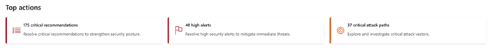
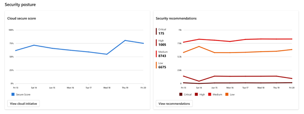
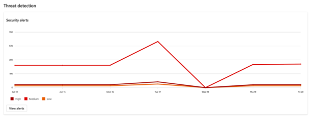

# What is the Defender for Cloud overview dashboard?

The Cloud overview dashboard is the new landing page for Microsoft Defender for Cloud in the Defender portal. It serves as the central hub for cloud security visibility, insights, and action, built with Cloud-Native Application Protection Platform (CNAPP) principles at its core. This dashboard gives security teams and workload owners a clear, actionable view of their cloud security status both pre- and post-breach, empowering them to understand their security posture, track progress over time, and take meaningful, immediate action, all from a single, unified experience. The overview dashboard also provides an at-scale view at the tenant-level or scope-based, helping users understand where to focus and how to drive effective security outcomes.

## Why it matters

As organizations scale their cloud environments, the need for a clear, actionable view of security status becomes critical. Customers have told us they want to know:

- “Am I more secure than yesterday?”
- “What should I focus on first?”
- “How do I show the value of Defender for Cloud to stakeholders?”

The overview dashboard answers these questions by providing a comprehensive, role-aware experience that supports both strategic oversight and tactical response.

## Who is the overview dashboard for?

The Overview Dashboard in Microsoft Defender for Cloud is designed with two core personas in mind. Each brings a unique perspective and set of responsibilities to cloud security—and the dashboard adapts to meet their needs.

### Cloud Security Admins, Architects, and Engineers

These users are responsible for the big picture. They need to understand the security posture of the entire cloud environment, identify risks, and make informed decisions that protect the organization.

They use the dashboard to:

- Assess the overall cloud security status across environments
- Monitor critical security metrics and trends
- Identify and prioritize risks
- Serve as a central hub for visibility and decision-making

This persona benefits from the dashboard’s high-level summaries, overtime tracking, and direct links to deeper insights like Exposure Management and Cloud Asset Inventory.

### Workload Owners (Developers, DevOps, DevSecOps)

These users are closer to the code and infrastructure. They’re responsible for specific workloads and need scoped, actionable insights to keep their areas secure.

They use the dashboard to:

- View security status based on their permissions and scope
- Identify and fix security issues in their workloads
- Track the progress of remediation efforts
- Use the dashboard as a landing page for daily operations

This persona benefits from workload-centric tiles, scoped filters, and actionable recommendations tailored to their domain.

## Top controls

At the top of the dashboard, you’ll find two key filters:

- **Scope Filter**: Choose the environment you want to view—tenant, subscription, or project. The dashboard adjusts based on your permissions.
- **Time Range**: Select 30 days, 3 months, or 6 months to view trends over time. This applies to all historical graphs and trend indicators.

## Dashboard components

### Security at a glance

This section gives you a quick snapshot of your current security status:

- **Cloud Secure Score**: Your overall cloud security risk score with a trend indicator.
- **Threat Protection**: Number of alerts by severity.
- **Resource Coverage**: Number of protected resources by Defender for Cloud plans and their coverage status (Full, Partial, None).
- All cloud and code environments that are currently connected to Defender for Cloud are presented.

:::image type="content" source="../media/defender-portal-dashboard/overview-highlights.png" alt-text="Screenshot of dashboard highlights":::

### Top actions

This section provides prioritized, actionable recommendations to help you reduce risk quickly. It helps you understand where to start and is designed to guide your next steps and reduce the attack surface efficiently. It highlights:

- **Critical Recommendations**: Focus on the most critical recommendations found in your environment.
- **High-Severity Incidents**: Investigate active alerts.
- **Attack Paths**: Understand potential lateral movement.
- **Connectivity Issues**: Identify connectivity issues preventing your connected cloud environments from being fully protected.

### Trends over time

Track how your security posture and threat detection evolve over time:

- **Security Posture**: View over time of the new cloud secure score in addition to recommendations by severity.

- **Threat Detection**: View trends in the number of alerts over time, categorized by severity.

Each graph updates daily and reflects the selected time range. Hover over data points to see daily breakdowns.

### Workload insights (powered by CNAPP)

Dive into security insights by workload type. Each tile in this section surfaces insights from Microsoft’s CNAPP.

Workloads include:

- VMs
- Containers
- APIs
- Data
- DevOps
- AI

Each tile acts as a mini dashboard, showing top issues, protection coverage, and links to detailed views—no sensitive or secret information is displayed. This helps teams focus on what matters most for each workload.

:::image type="content" source="../media/defender-portal-dashboard/api.png" alt-text="Screenshot of API widgits":::

## NextGen Portal enhancements

The Defender portal includes enhanced experiences that complement the overview dashboard with deeper insights and advanced capabilities:

### Enhanced infrastructure visibility
- **[Cloud Infrastructure Dashboard](../cloud-infrastructure-dashboard.md)**: Comprehensive cloud security visibility with unified insights across Azure, AWS, and GCP environments.
- **[Asset Management](../asset-inventory.md?pivots=defender-portal)**: Enhanced asset inventory with workload-specific tabs and advanced filtering capabilities.

### Advanced threat analysis
- **[Attack Path Analysis](../concept-attack-path.md?pivots=defender-portal)**: Visualize potential attack routes with choke point identification and cross-solution correlation.
- **[Vulnerability Management](../auto-deploy-vulnerability-assessment.md?pivots=defender-portal)**: Risk-based vulnerability prioritization with enhanced insights and filtering.

### Granular access control
- **[Cloud Scopes and Unified RBAC](../cloud-scopes-unified-rbac.md)**: Advanced permissions management with business-aligned resource scoping across cloud environments.
- **[Enhanced Notifications](../configure-email-notifications.md?pivots=defender-portal)**: Cloud scopes-integrated email alerts with granular control based on organizational structure.

These experiences work together to provide a comprehensive view of your cloud security posture while enabling precise, role-based access to relevant data and capabilities.

## Next steps

- Explore the [Cloud Infrastructure Dashboard](../cloud-infrastructure-dashboard.md) for unified multi-cloud visibility
- Configure [Cloud Scopes and Unified RBAC](../cloud-scopes-unified-rbac.md) for granular access control
- Review [Attack Path Analysis](../concept-attack-path.md?pivots=defender-portal) to understand potential threat vectors
- Set up [Enhanced Asset Management](../asset-inventory.md?pivots=defender-portal) with workload-specific insights
- Get started with [Defender for Cloud in the Defender portal](defender-for-cloud-in-defender-portal.md)
