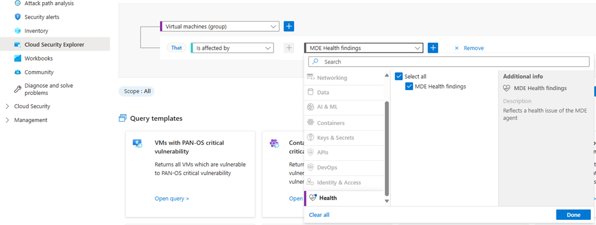
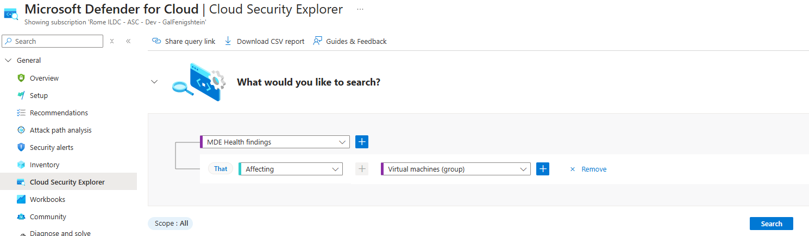
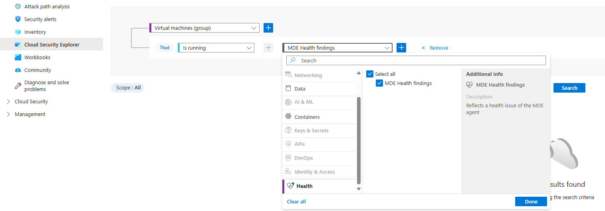
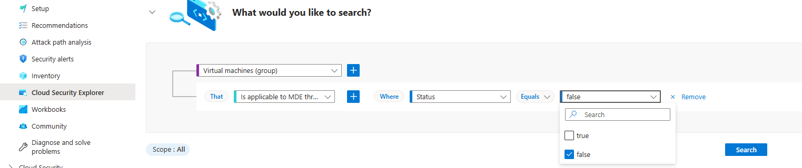

# Defender for Endpoint/Defender for Vulnerability Management integration

Microsoft Defender for Endpoint and Microsoft Defender Vulnerability Management integrate natively with Microsoft Defender for Cloud to provide:

- **Integrated security capabilities**: Security capabilities provided by Defender for Endpoint, Defender Vulnerability Management, and Defender for Cloud come together to provide end-to-end protection for machines protected by the Defender for Servers plan in Defender for Cloud.
- **Licensing**: Defender for Servers covers licensing for [Defender for Endpoint Plan 2](/defender-endpoint/microsoft-defender-endpoint). Licensing is charged per hour instead of per seat, lowering costs by protecting VMs only when they're in use.
- **Agent provisioning**: Defender for Cloud can automatically provision the Defender for Endpoint sensor on supported machines that are connected to Defender for Cloud.
- **Unified alerts**: Alerts and vulnerability data from Defender for Endpoint appear in Defender for Cloud in the Azure portal. You can move to the Defender portal to drill down for detailed alert information and context.

## Security capabilities

Defender for Cloud integrates these security capabilities provided by Defender for Endpoint and Defender Vulnerability Management.

- **Vulnerability management**: Provided by [Defender Vulnerability Management](/defender-vulnerability-management/defender-vulnerability-management).

  - Features include an [inventory of known software](/defender-vulnerability-management/tvm-software-inventory), [continuous vulnerability assessment and insights](/defender-vulnerability-management/tvm-weaknesses), [secure score for devices](/defender-vulnerability-management/tvm-microsoft-secure-score-devices), [prioritized security recommendations](/defender-vulnerability-management/tvm-security-recommendation), and [vulnerability remediation](/defender-vulnerability-management/tvm-remediation).
  - Integration with Defender Vulnerability Management also provides [premium features](/defender-vulnerability-management/defender-vulnerability-management-capabilities) in Defender for Servers Plan 2.

- **Attack surface reduction**: Use of [attack surface reduction rules](/defender-endpoint/attack-surface-reduction) to reduce security exposure.
- **Next-generation protection** providing [antimalware and antivirus protection](/defender-endpoint/next-generation-protection).
- **Endpoint detection and response (EDR)**: EDR [detects, investigates, and responds to advanced threats](/defender-endpoint/overview-endpoint-detection-response), including [advanced threat hunting](/defender-xdr/advanced-hunting-overview), and [automatic investigation and remediation capabilities](/defender-xdr/m365d-autoir).
- **Threat analytics**. [Get threat intelligence data](/defender-xdr/threat-analytics) provided by Microsoft threat hunters and security teams, augmented by intelligence provided by partners. Security alerts are generated when Defender for Endpoint identifies attacker tools, techniques, and procedures.

## Integration architecture

A Defender for Endpoint tenant is automatically created when you use Defender for Cloud to monitor your machines.

Data collected by Defender for Endpoint is stored in the geo-location of the tenant as identified during provisioning.

- Customer data, in pseudonymized form, might also be stored in the central storage and processing systems in the United States.
- After you configure the location, you can't change it.
- If you have your own license for Defender for Endpoint and need to move your data to another location, [contact Microsoft support](https://portal.azure.com/#blade/Microsoft_Azure_Support/HelpAndSupportBlade/overview) to reset the tenant.

## Move between subscriptions

- **Move to a different subscription in the same tenant**: To move your Defender for Endpoint extension to a different subscription in the same tenant, delete either the `MDE.Linux' or 'MDE.Windows` extension from the virtual machine and Defender for Cloud will automatically redeploy it.
- **Move subscriptions between tenants:** If you move your Azure subscription between Azure tenants, some manual preparatory steps are required before Defender for Cloud deploys Defender for Endpoint. For full details, [contact Microsoft support](https://portal.azure.com/#blade/Microsoft_Azure_Support/HelpAndSupportBlade/overview).

## Health status for Microsoft Defender for Endpoint

Microsoft Defender for Servers provides visibility to the Microsoft Defender for Endpoint agents installed on your VMs.

 

### Prerequisites

1. Onboarding to Microsoft Defender for Servers P2 or DCSPM + Microsoft Defender for Servers P1.

 

### Visibility into Health Issues in Defender for Servers

Microsoft Defender for Servers provides visibility into two main types of health issues:

1. __Installation Issues__: Errors that may occur during the installation process of the agent.

1. __Heartbeat Issues__: Scenarios where the agent is installed but is not reporting properly.

In some cases, Microsoft Defender for Endpoint might not be applicable for specific servers. This status is also reflected as described below.

For each issue type, Defender for Servers displays specific error messages that detail the nature of the problem. Where available, there are also instructions for remediation.

Health status information is refreshed every 4 hours, ensuring that any displayed issue reflects the state from no more than 4 hours prior.

 

In order to get visibility to MDE health issues, please using the security explorer as described below:

1. To get all the unhealthy VMs (with one of the above types of issues) run the following query:

Another option to consume this data:

1. To get all the healthy VMs where Microsoft Defender for Endpoints run properly, run the following query:

1. To get the list of VMs where Microsoft Defender for Endpoint is not applicable, run the following query:

## Next steps

[Learn more](endpoint-detection-response.md) about EDR recommendations in Defender for Servers.
