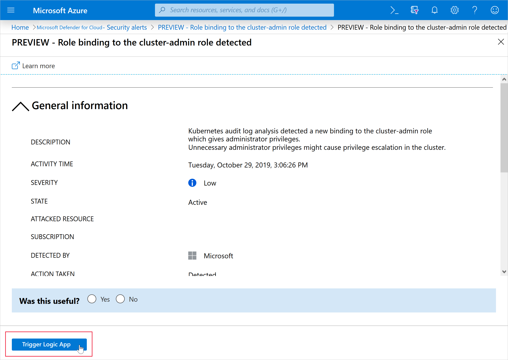

# Automate remediation responses

Every security program includes multiple workflows for incident response. These processes might include notifying relevant stakeholders, starting a change management process, and applying specific remediation steps.

Security experts recommend that you automate as many steps of security procedures as you can. Automation reduces overhead. It can also improve your security by ensuring process steps are done quickly, consistently, and according to your predefined requirements.

This article describes the workflow automation feature of Microsoft Defender for Cloud. This feature can trigger consumption logic apps on security alerts, recommendations, and changes to regulatory compliance. For example, you might want Defender for Cloud to email a specific user when an alert occurs. You'll also learn how to create logic apps by using [Azure Logic Apps](/azure/logic-apps/logic-apps-overview).

## Prerequisites

Before you start:

-   You need to have **Security admin role** or **Owner** on the resource group.

-   You must have write permissions for the target resource.

-   To work with Azure Logic Apps workflows, you must have the following Logic Apps roles or permissions:
    -   [Logic App Operator](/azure/role-based-access-control/built-in-roles#logic-app-operator) permissions are required or Logic App read or trigger access. Users with this role can't create or edit logic apps. They can only *run* existing ones.
    -   [Logic App Contributor](/azure/role-based-access-control/built-in-roles#logic-app-contributor) permissions are required for logic app creation and modification.

-   If you want to use Logic Apps connectors, you might need other credentials to sign in to their respective services (for example, your Outlook, Teams, or Slack instances).

## Create a logic app and define when it should automatically run

Follow these steps:

1.  On the Defender for Cloud sidebar, select **Workflow automation**.

    :::image type="content" source="./media/workflow-automation/list-of-workflow-automations.png" alt-text="Screenshot that shows the workflow automation pane with the list of defined automations." lightbox="./media/workflow-automation/list-of-workflow-automations.png":::

1.  On this page, you can create new automation rules or enable, disable, or delete existing ones. A scope refers to the subscription where the workflow automation is deployed.

1.  To define a new workflow, select **Add workflow automation**. The options pane for your new automation opens.

    :::image type="content" source="./media/workflow-automation/add-workflow.png" alt-text="Screenshot that shows the Workflow automation pane." lightbox="media/workflow-automation/add-workflow.png":::

1.  Enter the following:
    -   A name and description for the automation.
    -   The triggers that initiate this automatic workflow. For example, you might want your logic app to run when a security alert generates that contains the phrase *SQL*.

1.  Specify the consumption logic app that will run when your trigger conditions are met.

1.  On the **Actions** section, select **visit the Logic Apps page** to begin the process to create a logic app.

    :::image type="content" source="media/workflow-automation/visit-logic.png" alt-text="Screenshot that shows the Actions section of the Add workflow automation screen and the link to go to Azure Logic Apps." border="true":::

    You are taken to Azure Logic Apps.

1.  Select **(+) Add**.

1.  Fill out all required fields, and then select **Review + Create**.

    :::image type="content" source="media/workflow-automation/logic-apps-create-new.png" alt-text="Screenshot that shows where to create a logic app." lightbox="media/workflow-automation/logic-apps-create-new.png":::

    The message **Deployment is in progress** appears. Wait for the **Deployment complete** notification to appear, and then select **Go to resource**.

1.  Review the information you entered, and then select **Create**.

    In your new logic app, you can choose from built-in, predefined templates from the security category. Or you can define a custom flow of events that occur when this process is triggered.

    > [!TIP]
    > Sometimes, parameters are included in a logic app in the connector as part of a string and not in their own field. For an example of how to extract parameters, see step 14 of [Working with logic app parameters while building Microsoft Defender for Cloud workflow automations](https://techcommunity.microsoft.com/t5/azure-security-center/working-with-logic-app-parameters-while-building-azure-security/ba-p/1342121).

## Supported triggers

The logic app designer supports the following Defender for Cloud triggers:

-   **When a Microsoft Defender for Cloud recommendation is created or triggered**: If your logic app relies on a recommendation that gets deprecated or replaced, your automation stops working and you need to update the trigger. To track changes to recommendations, use the [release notes](release-notes.md).

-   **When a Defender for Cloud Alert is created or triggered**: You can customize the trigger so that it relates only to alerts with the severity levels that interest you.

-   **When a Defender for Cloud regulatory compliance assessment is created or triggered**: You want to trigger automations based on updates to regulatory compliance assessments.

> [!NOTE]
> If you're using the legacy trigger **When a response to a Microsoft Defender for Cloud alert is triggered**, the Workflow Automation feature doesn't open your logic apps. Instead, use either of the triggers mentioned previously.

1.  After you define your logic app, return to the **Add workflow automation** pane.

1.  Select **Refresh** to ensure your new logic app is available for selection.

1.  Select your logic app, and then save the automation. The dropdown menu shows only logic apps that have supporting Defender for Cloud connectors.

## Manually trigger a logic app

You can also manually run logic apps when you view any security alert or recommendation.

To manually run a logic app, open an alert or a recommendation, and then select **Trigger logic app**.

## Configure workflow automation at scale

When you automate your organization's monitoring and incident response processes, the time it takes to investigate and mitigate security incidents can greatly improve.

To deploy your automation configurations across your organization, use the supplied Azure Policy `DeployIfNotExist` policies (mentioned later) to create and configure workflow automation procedures.

Get started with [workflow automation templates](https://github.com/Azure/Azure-Security-Center/tree/master/Workflow%20automation).

To implement these policies:

1.  In the following table, select the policy that you want to apply:

    | Goal                                            | Policy                                                                                                                              | Policy ID                                    |
    | ----------------------------------------------- | ----------------------------------------------------------------------------------------------------------------------------------- | -------------------------------------------- |
    | Workflow automation for security alerts         | [Deploy Workflow Automation for Microsoft Defender for Cloud alerts](https://portal.azure.com/#view/Microsoft_Azure_Policy/PolicyDetailBlade/definitionId/%2Fproviders%2FMicrosoft.Authorization%2FpolicyDefinitions%2Ff1525828-9a90-4fcf-be48-268cdd02361e) | f1525828-9a90-4fcf-be48-268cdd02361e          |
    | Workflow automation for security recommendations | [Deploy Workflow Automation for Microsoft Defender for Cloud recommendations](https://portal.azure.com/#view/Microsoft_Azure_Policy/PolicyDetailBlade/definitionId/%2Fproviders%2FMicrosoft.Authorization%2FpolicyDefinitions%2F73d6ab6c-2475-4850-afd6-43795f3492ef) | 73d6ab6c-2475-4850-afd6-43795f3492ef          |
    | Workflow automation for regulatory compliance changes | [Deploy Workflow Automation for Microsoft Defender for Cloud regulatory compliance](https://portal.azure.com/#view/Microsoft_Azure_Policy/PolicyDetailBlade/definitionId/%2Fproviders%2FMicrosoft.Authorization%2FpolicyDefinitions%2F509122b9-ddd9-47ba-a5f1-d0dac20be63c) | 509122b9-ddd9-47ba-a5f1-d0dac20be63c          |

    You can also find policies by searching Azure Policy. In Azure Policy, select **Definitions**, and then search for them by name.

1.  On the relevant Azure Policy page, select **Assign**.

    :::image type="content" source="./media/workflow-automation/export-policy-assign.png" alt-text="Screenshot that shows how to assign the Azure policy.":::

1.  On the **Basics** tab, set the scope for the policy. To use centralized management, assign the policy to the **Management Group** that contains the subscriptions that use the workflow automation configuration.

1.  On the **Parameters** tab, enter the required information.

    :::image type="content" source="media/workflow-automation/parameters-tab.png" alt-text="Screenshot that shows the Parameters tab.":::

1.  (Optional) Apply this assignment to an existing subscription on the **Remediation** tab, and then select the option to create a remediation task.

1.  Review the summary page, and then select **Create**.

### Data types schemas

To view the raw event schemas of the security alerts or recommendations events that are passed to the logic app, go to the [data types schemas for workflow automation](https://aka.ms/ASCAutomationSchemas). This process can be useful in cases where you aren't using the Defender for Cloud built-in Logic Apps connectors (mentioned previously), but instead are using the generic HTTP connector. You can use the event JSON schema to manually parse it as you see fit.

## Related content

-   [Use workflow automation to automate a security response](/training/modules/resolve-threats-with-azure-security-center/)
-   [Security recommendations in Microsoft Defender for Cloud](review-security-recommendations.md)
-   [Security alerts in Microsoft Defender for Cloud](alerts-overview.md)