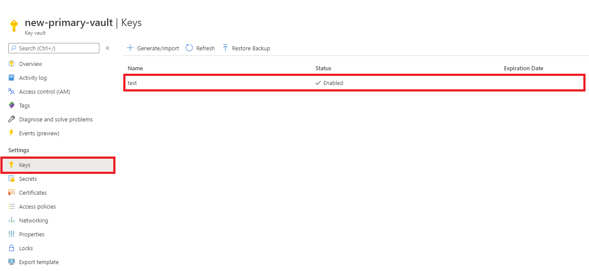
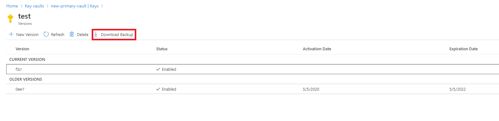
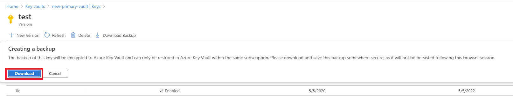
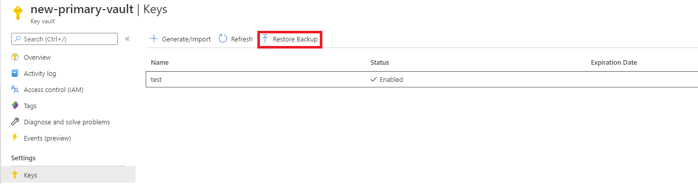

# Azure Key Vault backup and restore

This document shows you how to back up secrets, keys, and certificates stored in your key vault. A backup is intended to provide you with an offline copy of all your secrets in the unlikely event that you lose access to your key vault.

## Overview

Azure Key Vault provides multiple options for ensuring the availability and recoverability of your vault data:

- **Automatic redundancy and failover**: Key Vault automatically replicates data across regions and handles failover during outages - see [Azure Key Vault availability and redundancy](/azure/reliability/reliability-key-vault)
- **Soft delete and purge protection**: Prevents accidental or malicious deletion of your vault or vault objects - see [Azure Key Vault recovery management with soft delete and purge protection](key-vault-recovery.md)
- **Manual backup and restore** (covered in this article): For individual secrets, keys, and certificates

This article focuses on manual backup and restore operations for individual objects within Key Vault.

## When to use backups

Azure Key Vault automatically provides features to help you maintain availability and prevent data loss. Back up secrets only if you have a critical business justification. Backing up secrets in your key vault may introduce operational challenges such as maintaining multiple sets of logs, permissions, and backups when secrets expire or rotate.

Consider using backups in these scenarios:
- You need to move objects between key vaults or Azure regions
- You want an offline copy of your secrets for regulatory or compliance reasons
- You're using a region that doesn't support automatic cross-region replication (Brazil South, Brazil Southeast, or West US 3)
- You need protection against accidental deletion of specific objects

For most scenarios, Key Vault's built-in redundancy and soft delete features provide sufficient protection without requiring manual backups. For more information, see [Azure Key Vault availability and redundancy](/azure/reliability/reliability-key-vault).

## Limitations

> [!IMPORTANT]
> Key Vault does not support the ability to backup more than 500 past versions of a key, secret, or certificate object, and attempting to do so may result in an error. It is not possible to delete previous versions of a key, secret, or certificate.

Key Vault doesn't currently provide a way to back up an entire key vault in a single operation and keys, secrets, and certificates must be backup individually.

Also consider the following issues:

* Backing up secrets that have multiple versions might cause time-out errors.
* A backup creates a point-in-time snapshot. Secrets might renew during a backup, causing a mismatch of encryption keys.
* If you exceed key vault service limits for requests per second, your key vault will be throttled, and the backup will fail.

## Design considerations

When you back up a key vault object, such as a secret, key, or certificate, the backup operation will download the object as an encrypted blob. This blob can't be decrypted outside of Azure. To get usable data from this blob, you must restore the blob into a key vault within the same Azure subscription and [Azure geography](https://azure.microsoft.com/global-infrastructure/geographies/).

## Security considerations

When you restore a key to a different vault, the restored copy is fully independent of the original. Disabling, deleting, or purging the original key has no effect on any restored copies. They remain fully functional in their respective vaults. There is no mechanism in Azure Key Vault to revoke or invalidate a previously created backup blob or a key that has already been restored to another vault.

This independence has important implications for incident response. If you suspect a key has been compromised through unauthorized backup and restore, do not immediately disable or delete the key. Doing so takes all dependent services offline (for example, Azure SQL TDE databases become inaccessible, Azure Storage with customer-managed keys returns errors, and Azure Disk Encryption–protected VMs can't start) but does not affect any copies an attacker may have restored to another vault.

Instead, follow this incident response sequence:

1. **Contain the breach**: Immediately review and revoke any principals with backup or restore permissions on the compromised vault. Investigate Key Vault audit logs for unauthorized backup and restore activity to understand the scope of the compromise.
1. **Create a replacement key** in a separate vault with tightly restricted access. Use a new key (not a new version of the compromised key) to ensure the replacement can't be obtained from existing backup blobs.
1. **Reconfigure dependent services** to use the replacement key (each service re-wraps its data encryption keys with the new key).
1. **Verify** that all dependent services are operating normally with the replacement key.
1. **Disable the compromised key** only after dependent services are fully migrated. If purge protection is enabled on the vault, the key can't be permanently purged until the retention period expires, so leave it disabled until then.

To reduce the risk of unauthorized backup exfiltration, restrict backup and restore permissions to only the identities that genuinely require them. Monitor your Key Vault audit logs for `KeyBackup`, `KeyRestore`, `SecretBackup`, `SecretRestore`, `CertificateBackup`, and `CertificateRestore` operations and alert on unexpected activity. For more information, see [Azure Key Vault logging](logging.md).

For key-specific security best practices and key compromise response procedures, see [Secure your Azure Key Vault keys](../keys/secure-keys.md#key-compromise-response).

## Prerequisites

To back up a key vault object, you must have: 

* Contributor-level or higher permissions on an Azure subscription.
* A primary key vault that contains the secrets you want to back up.
* A secondary key vault where secrets will be restored.

## Back up and restore from the Azure portal

Follow the steps in this section to back up and restore objects by using the Azure portal.

### Back up

1. Go to the Azure portal.
1. Select your key vault.
1. Go to the object (secret, key, or certificate) you want to back up.

    

1. Select the object.
1. Select **Download Backup**.

    
    
1. Select **Download**.

    
    
1. Store the encrypted blob in a secure location.

### Restore

1. Go to the Azure portal.
1. Select your key vault.
1. Go to the type of object (secret, key, or certificate) you want to restore.
1. Select **Restore Backup**.

    
    
1. Go to the location where you stored the encrypted blob.
1. Select **OK**.

## Back up and restore from the Azure CLI or Azure PowerShell

# [Azure CLI](#tab/azure-cli)
```azurecli
## Log in to Azure
az login

## Set your subscription
az account set --subscription <subscription-id>

## Register Key Vault as a provider
az provider register -n Microsoft.KeyVault

## Back up a certificate in Key Vault
az keyvault certificate backup --file <file-path> --name <certificate-name> --vault-name <vault-name> --subscription <subscription-id>

## Back up a key in Key Vault
az keyvault key backup --file <file-path> --name <key-name> --vault-name <vault-name> --subscription <subscription-id>

## Back up a secret in Key Vault
az keyvault secret backup --file <file-path> --name <secret-name> --vault-name <vault-name> --subscription <subscription-id>

## Restore a certificate in Key Vault
az keyvault certificate restore --file <file-path> --vault-name <vault-name> --subscription <subscription-id>

## Restore a key in Key Vault
az keyvault key restore --file <file-path> --vault-name <vault-name> --subscription <subscription-id>

## Restore a secret in Key Vault
az keyvault secret restore --file <file-path> --vault-name <vault-name> --subscription <subscription-id>
```
# [Azure PowerShell](#tab/powershell)

```azurepowershell
## Log in to Azure
Connect-AzAccount

## Set your subscription
Set-AzContext -Subscription '<subscription-id>'

## Back up a certificate in Key Vault
Backup-AzKeyVaultCertificate -VaultName '<vault-name>' -Name '<certificate-name>'

## Back up a key in Key Vault
Backup-AzKeyVaultKey -VaultName '<vault-name>' -Name '<key-name>'

## Back up a secret in Key Vault
Backup-AzKeyVaultSecret -VaultName '<vault-name>' -Name '<secret-name>'

## Restore a certificate in Key Vault
Restore-AzKeyVaultCertificate -VaultName '<vault-name>' -InputFile '<file-path>'

## Restore a key in Key Vault
Restore-AzKeyVaultKey -VaultName '<vault-name>' -InputFile '<file-path>'

## Restore a secret in Key Vault
Restore-AzKeyVaultSecret -VaultName '<vault-name>' -InputFile '<file-path>'
```
---

## Next steps

- [Azure Key Vault availability and redundancy](/azure/reliability/reliability-key-vault)
- [Azure Key Vault recovery management with soft delete and purge protection](key-vault-recovery.md)
- [Move an Azure key vault across regions](/azure/operational-excellence/relocation-key-vault)
- [Enable Key Vault logging](howto-logging.md) for Key Vault
