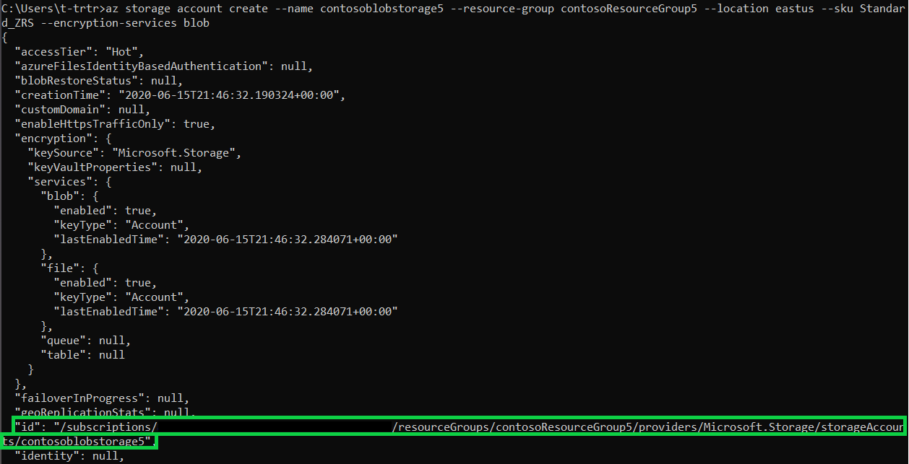
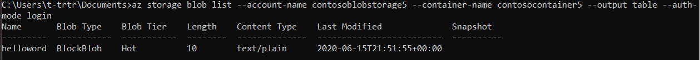
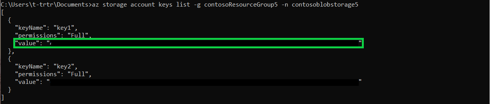
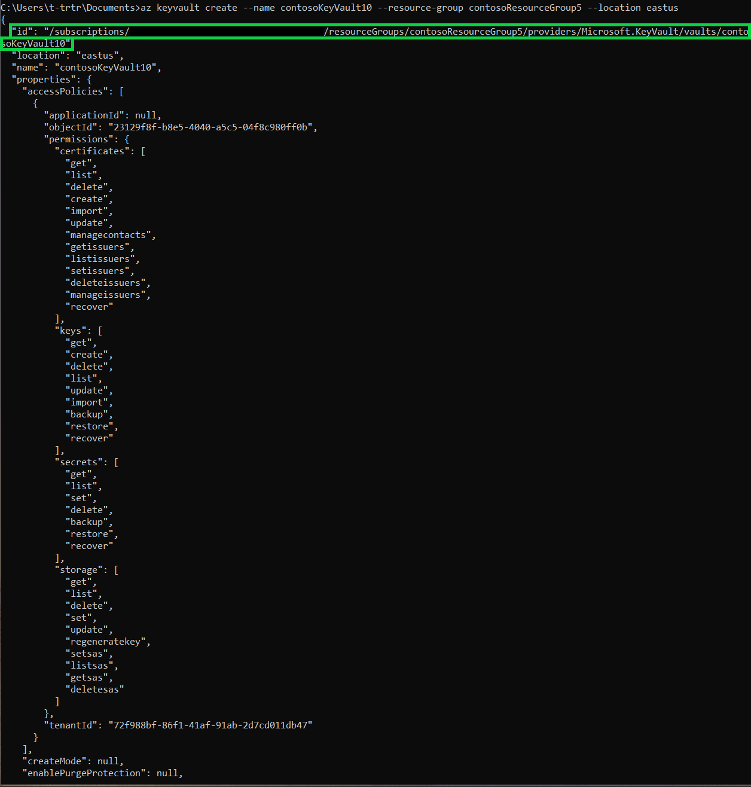
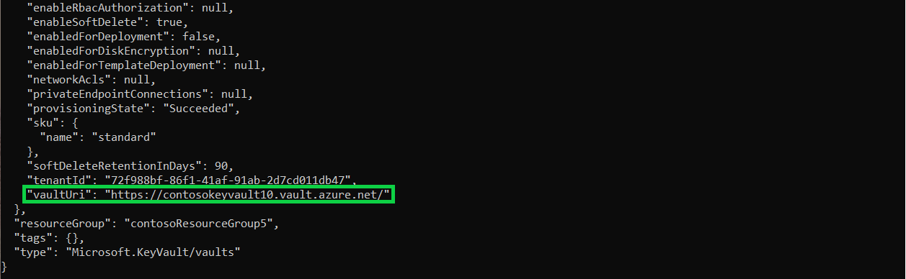

# Tutorial: Access Azure Blob Storage using Azure Databricks and Azure Key Vault

In this tutorial, you access Azure Blob Storage from Azure Databricks by using a storage account key stored in Azure Key Vault.

> [!IMPORTANT]
> Storage account key access is a legacy pattern. For new workloads, use Microsoft Entra ID authorization with Azure Databricks (through Unity Catalog credentials or an ABFS-mount that uses OAuth), and [disable Shared Key authorization on the storage account](/azure/storage/common/shared-key-authorization-prevent). Entra ID authorization removes the need to store or rotate storage account keys and provides fine-grained auditing. The steps in this article remain valid for storage accounts that still use Shared Key access.

In this tutorial, you:

> [!div class="checklist"]
> * Create a storage account and blob container with the Azure CLI.
> * Create a key vault and set a secret.
> * Create an Azure Databricks workspace and add a Key Vault secret scope.
> * Access your blob container from the Azure Databricks workspace.

## Prerequisites

If you don't have an Azure subscription, create a [free account](https://azure.microsoft.com/pricing/purchase-options/azure-account?cid=msft_learn) before you begin.

Before you start this tutorial, install the [Azure CLI](/cli/azure/install-azure-cli-windows).

## Create a storage account and blob container with Azure CLI

Create a general-purpose storage account to use blobs. If you don't have a [resource group](/cli/azure/group#az-group-create), create one before running the command. The following command creates the storage account and displays its metadata. Copy the **id** value.

```azurecli
az storage account create --name <storage-account-name> --resource-group <resource-group> --location <location> --sku Standard_ZRS --encryption-services blob
```



Before you create a container to upload the blob to, assign the [Storage Blob Data Contributor](/azure/role-based-access-control/built-in-roles#storage-blob-data-contributor) role to yourself. For this example, the role is assigned on the storage account you created earlier.

```azurecli
az role assignment create --role "Storage Blob Data Contributor" --assignee <user-principal-name> --scope "/subscriptions/<subscription-id>/resourceGroups/<resource-group>/providers/Microsoft.Storage/storageAccounts/<storage-account-name>
```

Now that you've assigned the role, create a container for your blob:

```azurecli
az storage container create --account-name <storage-account-name> --name <container-name> --auth-mode login
```

After the container is created, upload a blob (file of your choice) to it. In this example, a .txt file with `helloworld` is uploaded.

```azurecli
az storage blob upload --account-name <storage-account-name> --container-name <container-name> --name helloworld --file helloworld.txt --auth-mode login
```

List the blobs in the container to verify:

```azurecli
az storage blob list --account-name <storage-account-name> --container-name <container-name> --output table --auth-mode login
```



Get the **key1** value of your storage account with the following command. Copy the value.

```azurecli
az storage account keys list -g <resource-group> -n <storage-account-name>
```



## Create a key vault and set a secret

Create a key vault with the following command. The command also displays the key vault's metadata. Copy the **id** and **vaultUri** values.

```azurecli
az keyvault create --name <vault-name> --resource-group <resource-group> --location <location> --enable-rbac-authorization true --enable-purge-protection true
```




To create the secret, use the following command. Set the value of the secret to the **key1** value from your storage account.

```azurecli
az keyvault secret set --vault-name <vault-name> --name storageKey --value "value of your key1"
```

## Create an Azure Databricks workspace and add a Key Vault secret scope

This section requires the [Azure portal](https://portal.azure.com/#home). Use it to:

1. Create your Azure Databricks resource.
1. Launch your workspace.
1. Create a Key Vault-backed secret scope.

## Access your blob container from the Azure Databricks workspace

This section is completed in the Azure Databricks workspace. In the workspace:

1. Create a **New Cluster**.
1. Create a **New Notebook**.
1. Fill in the corresponding fields in the Python script.
1. Run the Python script.

```python
dbutils.fs.mount(
source = "wasbs://<container-name>@<storage-account-name>.blob.core.windows.net",
mount_point = "/mnt/<mount-name>",
extra_configs = {"<conf-key>":dbutils.secrets.get(scope = "<scope-name>", key = "<key-name>")})

df = spark.read.text("/mnt/<mount-name>/<file-name>")

df.show()
```

## Next steps

Make sure your Key Vault is recoverable:
> [!div class="nextstepaction"]
> [Clean up your resources](/azure/azure-resource-manager/management/delete-resource-group?tabs=azure-powershell)
