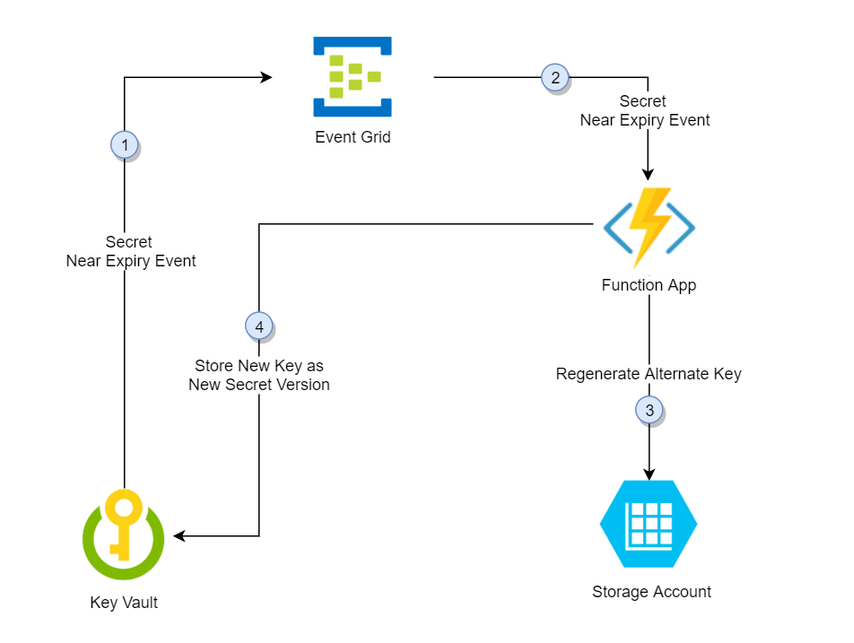
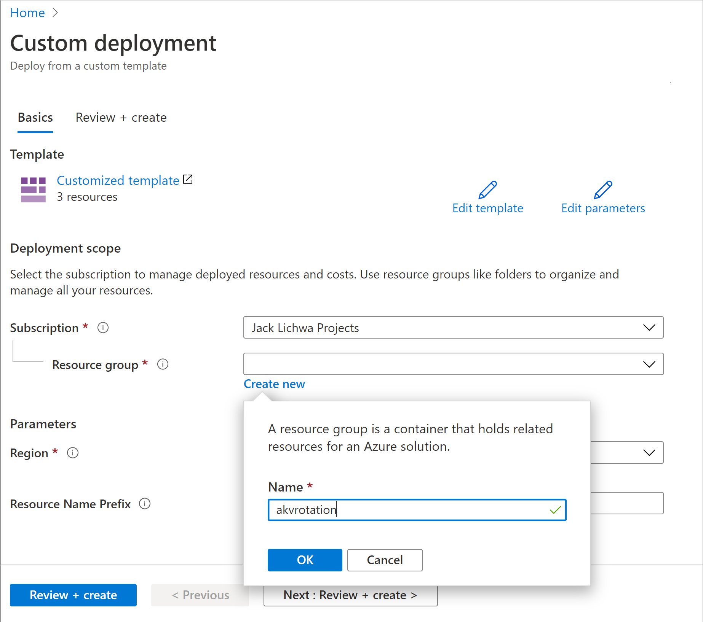
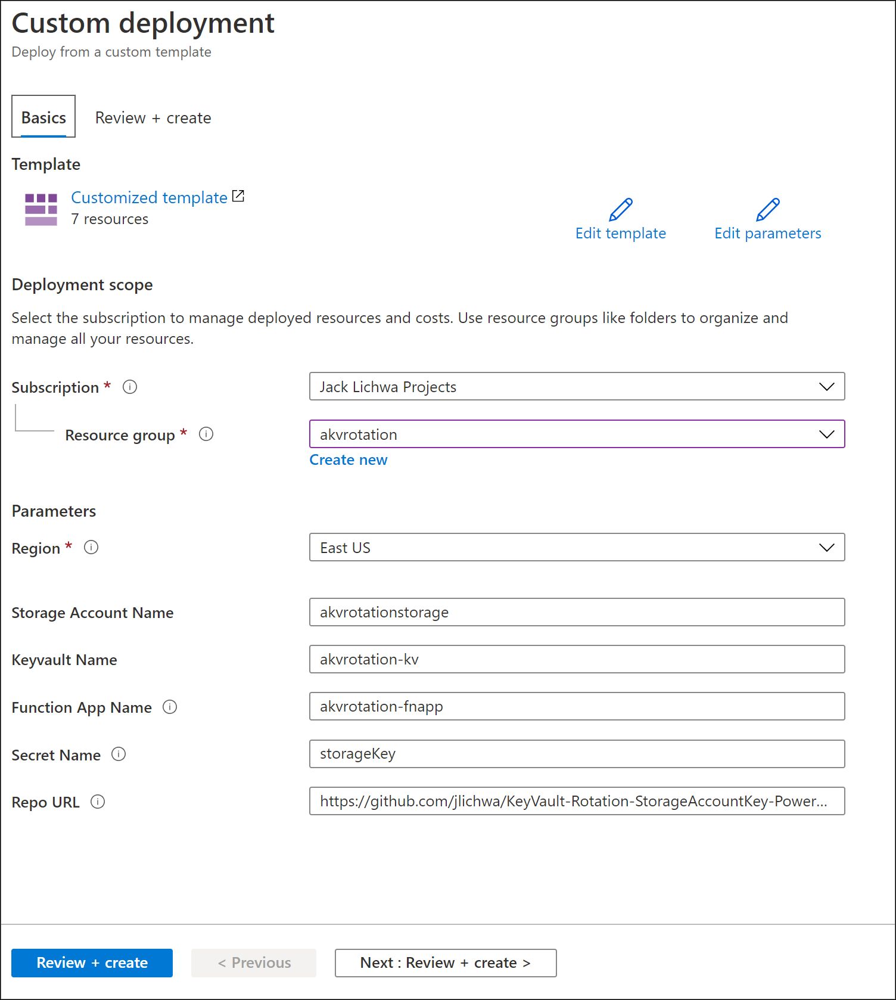
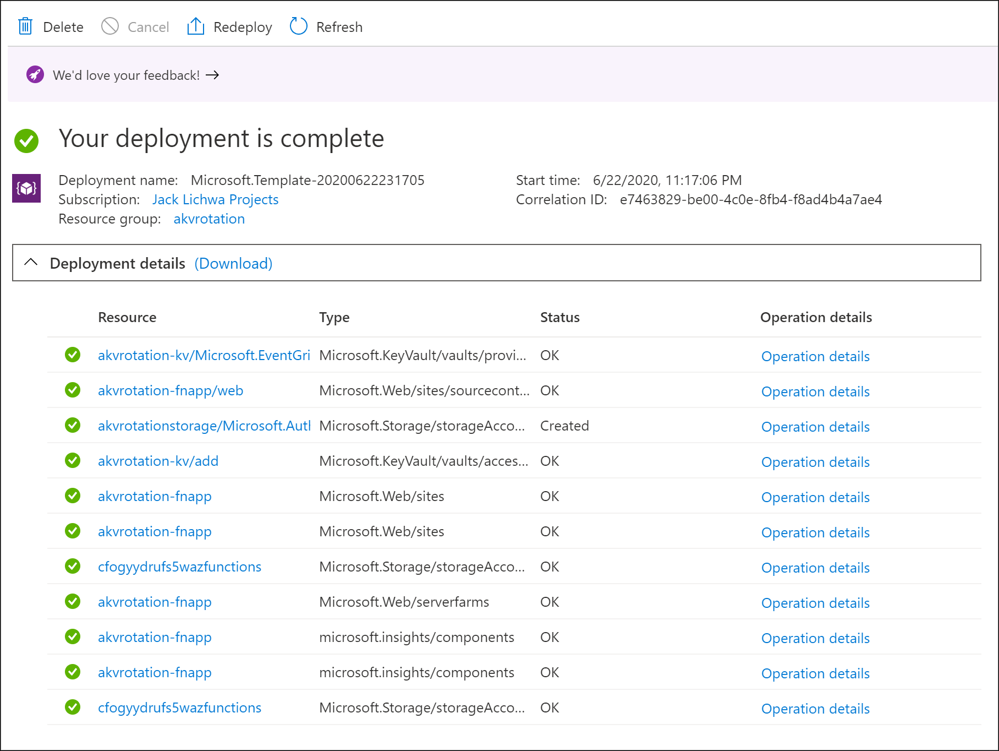
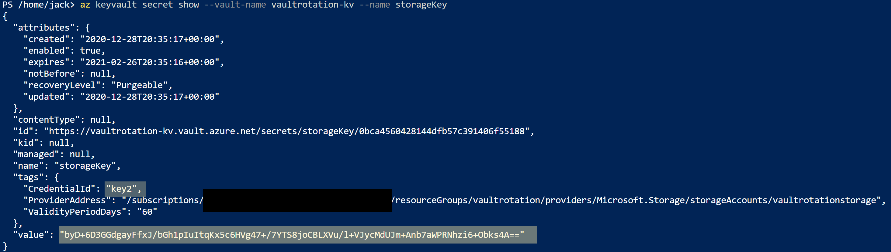
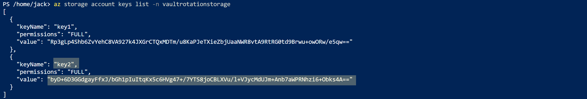
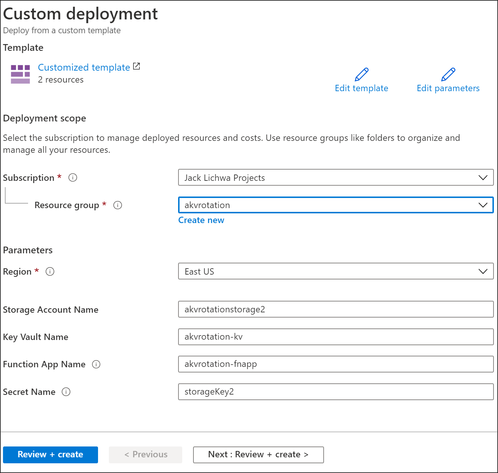
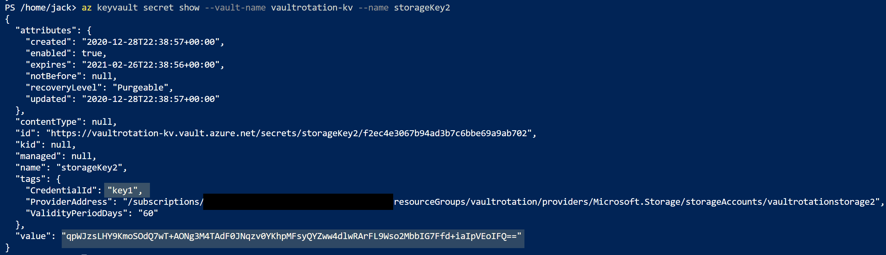
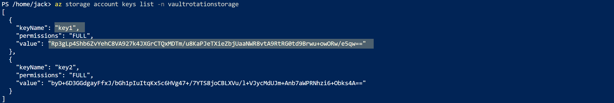

# Automate the rotation of a secret for resources that have two sets of authentication credentials

The best way to authenticate to Azure services is with a [managed identity](../general/authentication.md), but some scenarios still require access keys or passwords. Rotate those credentials often to reduce the impact of a leak.

This tutorial shows how to automate periodic secret rotation for databases and services that use two sets of authentication credentials. For an overview of autorotation across different asset types, see [Understanding autorotation in Azure Key Vault](../general/autorotation.md).

Specifically, this tutorial rotates Azure Storage account keys that are stored in Azure Key Vault as secrets. It uses a function that's triggered by an Azure Event Grid notification.

> [!IMPORTANT]
> For Azure Storage, prefer [Microsoft Entra ID authorization](/azure/storage/blobs/authorize-access-azure-active-directory) with a managed identity over shared account keys. Where compliance allows, [disable Shared Key authorization on the storage account](/azure/storage/common/shared-key-authorization-prevent) and remove the need for key rotation entirely. Use the pattern in this tutorial only when a workload requires a storage account key or a connection string.

Here's the rotation solution described in this tutorial:



In this solution, Azure Key Vault stores each storage account access key as a version of the same secret, alternating between the primary and secondary key in successive versions. When one access key is stored as the latest version of the secret, the alternate key is regenerated and added to Key Vault as the new latest version. This design gives the application a full rotation cycle to pick up the newly regenerated key.

1. Thirty days before the expiration date of a secret, Key Vault publishes the near-expiry event to Event Grid.
1. Event Grid checks the event subscriptions and uses HTTP POST to call the function app endpoint subscribed to the event.
1. The function app identifies the alternate key (not the latest one) and calls the storage account to regenerate it.
1. The function app adds the regenerated key to Azure Key Vault as the new version of the secret.

## Prerequisites
* An Azure subscription. [Create one for free.](https://azure.microsoft.com/pricing/purchase-options/azure-account?cid=msft_learn)
* Azure [Cloud Shell](https://shell.azure.com/). This tutorial uses portal Cloud Shell with the PowerShell environment.
* An Azure key vault.
* Two Azure storage accounts.

> [!NOTE]
> Rotating a shared storage account key revokes any account-level shared access signature (SAS) generated from that key. After rotation, regenerate account-level SAS tokens to avoid disruption to applications.

If you don't have an existing key vault and two storage accounts, use this deployment link:

[](https://portal.azure.com/#create/Microsoft.Template/uri/https%3A%2F%2Fraw.githubusercontent.com%2FAzure-Samples%2FKeyVault-Rotation-StorageAccountKey-PowerShell%2Fmaster%2FARM-Templates%2FInitial-Setup%2Fazuredeploy.json)

1. Under **Resource group**, select **Create new**. Name the group **vault rotation** and then select **OK**.
1. Select **Review + create**.
1. Select **Create**.

    

You now have a key vault and two storage accounts. Verify this setup in the Azure CLI or Azure PowerShell:
# [Azure CLI](#tab/azure-cli)
```azurecli
az resource list -o table -g vaultrotation
```
# [Azure PowerShell](#tab/azurepowershell)

```azurepowershell
Get-AzResource -Name 'vaultrotation*' | Format-Table
```
---

The result looks similar to the following output:

```console
Name                     ResourceGroup         Location    Type                               Status
-----------------------  --------------------  ----------  ---------------------------------  --------
vaultrotation-kv         vaultrotation      westus      Microsoft.KeyVault/vaults
vaultrotationstorage     vaultrotation      westus      Microsoft.Storage/storageAccounts
vaultrotationstorage2    vaultrotation      westus      Microsoft.Storage/storageAccounts
```

## Create and deploy the key rotation function

Next, create a function app with a system-assigned managed identity along with the other required components, and deploy the rotation function for the storage account keys.

The rotation function requires the following components and configuration:
- An Azure App Service plan.
- A storage account to manage function app triggers.
- An Azure role assignment that lets the function app access secrets in the key vault.
- The **Storage Account Key Operator Service Role** assigned to the function app so it can access storage account access keys.
- A key rotation function with an Event Grid trigger and an HTTP trigger (for on-demand rotation).
- An Event Grid event subscription for the **SecretNearExpiry** event.

1. Select the Azure template deployment link:

   [](https://portal.azure.com/#create/Microsoft.Template/uri/https%3A%2F%2Fraw.githubusercontent.com%2FAzure-Samples%2FKeyVault-Rotation-StorageAccountKey-PowerShell%2Fmaster%2FARM-Templates%2FFunction%2Fazuredeploy.json)

1. In the **Resource group** list, select **vaultrotation**.
1. In **Storage Account RG**, enter the name of the resource group where the storage account is located. Keep the default `[resourceGroup().name]` if the storage account is in the same resource group as the rotation function.
1. In **Storage Account Name**, enter the name of the storage account whose access keys you want to rotate. Keep the default `[concat(resourceGroup().name, 'storage')]` if you use the storage account from [Prerequisites](#prerequisites).
1. In **Key Vault RG**, enter the name of the resource group where the key vault is located. Keep the default `[resourceGroup().name]` if the key vault is in the same resource group as the rotation function.
1. In **Key Vault Name**, enter the key vault name. Keep the default `[concat(resourceGroup().name, '-kv')]` if you use the key vault from [Prerequisites](#prerequisites).
1. In **App Service Plan Type**, select the hosting plan. **Premium Plan** is required only when the key vault is behind a firewall.
1. In **Function App Name**, enter the function app name.
1. In **Secret Name**, enter the secret name that stores the access keys.
1. In **Repo URL**, enter the GitHub location of the function code: `https://github.com/Azure-Samples/KeyVault-Rotation-StorageAccountKey-PowerShell.git`.
1. Select **Review + create**.
1. Select **Create**.

   

After the deployment completes, you have a storage account, a server farm, a function app, and an Application Insights resource:

   

> [!NOTE]
> This ARM template uses App Service source-control (Kudu) deployment to pull the function code from GitHub. For a production workload, we recommend a package-based deployment such as [`func azure functionapp publish`](/azure/azure-functions/functions-run-local#project-file-deployment) or [zip deploy with `WEBSITE_RUN_FROM_PACKAGE`](/azure/azure-functions/run-functions-from-deployment-package) instead. If the deployment fails, select **Redeploy** to retry.

Deployment templates and code for the rotation function are in [Azure-Samples/KeyVault-Rotation-StorageAccountKey-PowerShell](https://github.com/Azure-Samples/KeyVault-Rotation-StorageAccountKey-PowerShell).

### Add the storage account access keys to Key Vault secrets

First, assign yourself the **Key Vault Secrets Officer** role so that you can manage secrets in the vault:
# [Azure CLI](#tab/azure-cli)
```azurecli
az role assignment create --role "Key Vault Secrets Officer" --assignee <email-address-of-user> --scope /subscriptions/<subscription-id>/resourceGroups/<resource-group>/providers/Microsoft.KeyVault/vaults/vaultrotation-kv
```
# [Azure PowerShell](#tab/azurepowershell)

```azurepowershell
New-AzRoleAssignment -SignInName <email-address-of-user> -RoleDefinitionName "Key Vault Secrets Officer" -Scope "/subscriptions/<subscription-id>/resourceGroups/<resource-group>/providers/Microsoft.KeyVault/vaults/vaultrotation-kv"
```
---

You can now create a secret whose value is a storage account access key. Along with the value, add the storage account resource ID, secret validity period, and key ID as tags so that the rotation function can regenerate the key in the storage account.

Determine the storage account resource ID. It's the `id` property:

# [Azure CLI](#tab/azure-cli)
```azurecli
az storage account show -n vaultrotationstorage
```
# [Azure PowerShell](#tab/azurepowershell)

```azurepowershell
Get-AzStorageAccount -Name vaultrotationstorage -ResourceGroupName vaultrotation | Select-Object -Property *
```
---

List the storage account access keys so you can get the key values:
# [Azure CLI](#tab/azure-cli)
```azurecli
az storage account keys list -n vaultrotationstorage
```
# [Azure PowerShell](#tab/azurepowershell)

```azurepowershell
Get-AzStorageAccountKey -Name vaultrotationstorage -ResourceGroupName vaultrotation
```
---

Add the secret to the key vault with a validity period of 60 days and (for demonstration) an expiration date of tomorrow to trigger rotation immediately. Run this command with your retrieved values for `key1Value` and `storageAccountResourceId`:

# [Azure CLI](#tab/azure-cli)
```azurecli
tomorrowDate=$(date -u -d "+1 day" +"%Y-%m-%dT%H:%M:%SZ")
az keyvault secret set --name storageKey --vault-name vaultrotation-kv --value <key1-value> --tags "CredentialId=key1" "ProviderAddress=<storage-account-resource-id>" "ValidityPeriodDays=60" --expires $tomorrowDate
```
# [Azure PowerShell](#tab/azurepowershell)

```azurepowershell
$tomorrowDate = (Get-Date).AddDays(+1).ToString('yyyy-MM-ddTHH:mm:ssZ')
$secretValue = ConvertTo-SecureString -String '<key1-value>' -AsPlainText -Force
$tags = @{
    CredentialId='key1'
    ProviderAddress='<storage-account-resource-id>'
    ValidityPeriodDays='60'
}
Set-AzKeyVaultSecret -Name storageKey -VaultName vaultrotation-kv -SecretValue $secretValue -Tag $tags -Expires $tomorrowDate
```
---

This secret triggers a `SecretNearExpiry` event within several minutes, which in turn triggers the function to rotate the secret with an expiration set 60 days out. In that configuration, the `SecretNearExpiry` event fires every 30 days (30 days before expiry), and the rotation function alternates between `key1` and `key2`.

Verify that access keys regenerated by retrieving the storage account key and the Key Vault secret, then comparing them.

Use this command to get the secret information:
# [Azure CLI](#tab/azure-cli)
```azurecli
az keyvault secret show --vault-name vaultrotation-kv --name storageKey
```
# [Azure PowerShell](#tab/azurepowershell)

```azurepowershell
Get-AzKeyVaultSecret -VaultName vaultrotation-kv -Name storageKey -AsPlainText
```
---

Notice that `CredentialId` is updated to the alternate `keyName` and that `value` is regenerated:



Retrieve the access keys to compare the values:

# [Azure CLI](#tab/azure-cli)
```azurecli
az storage account keys list -n vaultrotationstorage
```
# [Azure PowerShell](#tab/azurepowershell)

```azurepowershell
Get-AzStorageAccountKey -Name vaultrotationstorage -ResourceGroupName vaultrotation
```
---

Notice that the key value matches the secret in the key vault:



## Use an existing rotation function for multiple storage accounts

You can reuse the same function app to rotate keys for more than one storage account.

To add another storage account's keys to an existing rotation function, you need:
- The **Storage Account Key Operator Service Role** assigned to the function app so it can access storage account access keys.
- An Event Grid event subscription for the **SecretNearExpiry** event.

1. Select the Azure template deployment link: 

   [](https://portal.azure.com/#create/Microsoft.Template/uri/https%3A%2F%2Fraw.githubusercontent.com%2FAzure-Samples%2FKeyVault-Rotation-StorageAccountKey-PowerShell%2Fmaster%2FARM-Templates%2FAdd-Event-Subscriptions%2Fazuredeploy.json)

1. In the **Resource group** list, select **vaultrotation**.
1. In **Storage Account RG**, enter the name of the resource group where the storage account is located. Keep the default `[resourceGroup().name]` if the storage account is in the same resource group as the rotation function.
1. In **Storage Account Name**, enter the name of the storage account whose access keys you want to rotate.
1. In **Key Vault RG**, enter the name of the resource group where the key vault is located. Keep the default `[resourceGroup().name]` if the key vault is in the same resource group as the rotation function.
1. In **Key Vault Name**, enter the key vault name.
1. In **Function App Name**, enter the function app name.
1. In **Secret Name**, enter the secret name that stores the access keys.
1. Select **Review + create**.
1. Select **Create**.

   

### Add storage account access key to Key Vault secrets

Determine the storage account resource ID. You can find this value in the `id` property.
# [Azure CLI](#tab/azure-cli)
```azurecli
az storage account show -n vaultrotationstorage2
```
# [Azure PowerShell](#tab/azurepowershell)

```azurepowershell
Get-AzStorageAccount -Name vaultrotationstorage -ResourceGroupName vaultrotation | Select-Object -Property *
```
---

List the storage account access keys so you can get the key2 value:
# [Azure CLI](#tab/azure-cli)
```azurecli
az storage account keys list -n vaultrotationstorage2
```
# [Azure PowerShell](#tab/azurepowershell)

```azurepowershell
Get-AzStorageAccountKey -Name vaultrotationstorage2 -ResourceGroupName vaultrotation
```
---

Add the secret to the key vault with a validity period of 60 days and (for demonstration) an expiration date of tomorrow to trigger rotation immediately. Run this command with your retrieved values for `key2Value` and `storageAccountResourceId`:

# [Azure CLI](#tab/azure-cli)
```azurecli
tomorrowDate=$(date -u -d "+1 day" +"%Y-%m-%dT%H:%M:%SZ")
az keyvault secret set --name storageKey2 --vault-name vaultrotation-kv --value <key2-value> --tags "CredentialId=key2" "ProviderAddress=<storage-account-resource-id>" "ValidityPeriodDays=60" --expires $tomorrowDate
```
# [Azure PowerShell](#tab/azurepowershell)

```azurepowershell
$tomorrowDate = (get-date).AddDays(+1).ToString("yyyy-MM-ddTHH:mm:ssZ")
$secretValue = ConvertTo-SecureString -String '<key1-value>' -AsPlainText -Force
$tags = @{
    CredentialId='key2';
    ProviderAddress='<storage-account-resource-id>';
    ValidityPeriodDays='60'
}
Set-AzKeyVaultSecret -Name storageKey2 -VaultName vaultrotation-kv -SecretValue $secretValue -Tag $tags -Expires $tomorrowDate
```
---

Use this command to get the secret information:
# [Azure CLI](#tab/azure-cli)
```azurecli
az keyvault secret show --vault-name vaultrotation-kv --name storageKey2
```
# [Azure PowerShell](#tab/azurepowershell)

```azurepowershell
Get-AzKeyVaultSecret -VaultName vaultrotation-kv -Name storageKey2 -AsPlainText
```
---

Notice that `CredentialId` is updated to the alternate `keyName` and that `value` is regenerated:



Retrieve the access keys to compare the values:

# [Azure CLI](#tab/azure-cli)
```azurecli
az storage account keys list -n vaultrotationstorage2
```
# [Azure PowerShell](#tab/azurepowershell)

```azurepowershell
Get-AzStorageAccountKey -Name vaultrotationstorage2 -ResourceGroupName vaultrotation
```
---

Notice that the key value matches the secret in the key vault:



## Disable rotation for a secret

To disable rotation for a secret, delete the Event Grid subscription for that secret. Use the Azure PowerShell [Remove-AzEventGridSubscription](/powershell/module/az.eventgrid/remove-azeventgridsubscription) cmdlet or the Azure CLI [az eventgrid event-subscription delete](/cli/azure/eventgrid/event-subscription#az-eventgrid-event-subscription-delete) command.

## Use AI to customize the rotation function for other services

This tutorial demonstrates secret rotation for Azure Storage accounts, but you can adapt the rotation function for other Azure services that use dual credentials. GitHub Copilot can help you modify the PowerShell rotation function code to work with your service.

```copilot-prompt
I'm using the Azure Key Vault dual-credential secret rotation tutorial for Storage accounts. Help me modify the PowerShell rotation function to work with Azure Cosmos DB instead. The function should:
1. Connect to Cosmos DB and regenerate the secondary key
2. Store the new key in Key Vault as a new secret version
3. Alternate between primary and secondary keys on each rotation
Show me the changes needed to the PowerShell function code, including the correct Cosmos DB PowerShell cmdlets.
```

[!INCLUDE [copilot-highlights-disclaimer](~/reusable-content/ce-skilling/azure/includes/copilot-highlights-disclaimer.md)]

## Next steps

- [Secrets rotation for one set of credentials](./tutorial-rotation.md)
- [Understanding autorotation in Azure Key Vault](../general/autorotation.md)
- [Monitoring Key Vault with Azure Event Grid](../general/event-grid-overview.md)
- [Create your first function in the Azure portal](/azure/azure-functions/functions-get-started)
- [Receive email when a Key Vault secret changes](../general/event-grid-logicapps.md)
- [Azure Event Grid event schema for Azure Key Vault](/azure/event-grid/event-schema-key-vault)
